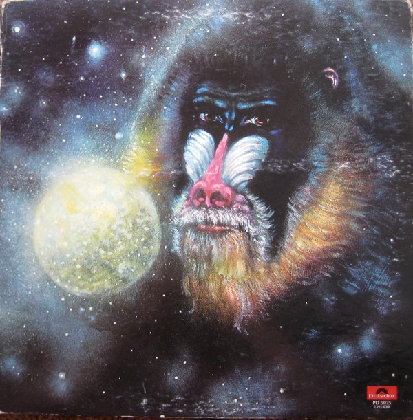

# Mandrill Is

By Mandrill

## Album Data

[Discogs URL](https://www.discogs.com/release/554699-Mandrill-Mandrill-Is)

- Label: Polydor
Polydor
- Formats: Vinyl, LP, Album, Stereo
- Genres: Funk / Soul, Funk
- Rating: 4.21
- Released: 1972
- Year: 1972
- Release ID: 554699
- Media condition: 
- Sleeve condition: 
- Speed: 
- Weight: 
- Notes: 

## Album Tracks

| **Position** | **Title** | **Duration** |
|--------------|-----------|--------------|
| A1 | **Ape Is High** | 5:32 |
| A2 | **Cohelo** | 1:50 |
| A3 | **Git It All** | 4:30 |
| A4 | **Children Of The Sun** | 5:00 |
| A5 | **I Refuse To Smile** | 4:05 |
| B1 | **Universal Rhythms** | 3:24 |
| B2 | **Lord Of The Golden Baboon** | 3:33 |
| B3 | **Central Park** | 4:05 |
| B4 | **Kofijahm** | 3:25 |
| B5 | **Here Today Gone Tomorrow** | 4:30 |
| B6 | **The Sun Must Go Down** | 3:17 |

## Artist Roles

| **Name** | **Role** |
|----------|----------|
| **Ron Nackman** | Art Direction |
| **Joseph Westerfield** | Artwork |
| **Joseph Westerfield** | Design Concept, Design |
| **Mandrill** | Design Concept, Design |
| **Shelly Yakus** | Engineer |
| **Steve Bruno (2)** | Engineer [Assistant Engineer (Uncredited)] |
| **Andy Edlen** | Engineer [Assistant Engineer] |
| **Dave Palmer (2)** | Engineer, Recorded By, Mixed By |
| **Alfred Brown** | Producer |
| **Mandrill** | Producer |
| **Mandrill** | Written-By, Arranged By |

