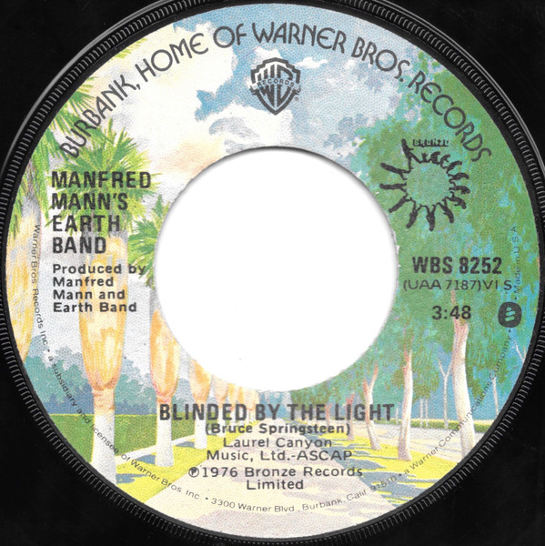

# Blinded By The Light

By Manfred Mann's Earth Band

## Album Data

[Discogs URL](https://www.discogs.com/release/2903225-Manfred-Manns-Earth-Band-Blinded-By-The-Light)

- Label: Warner Bros. Records
Bronze
- Formats: Vinyl, 7", 45 RPM, Single
- Genres: Rock, Pop, Prog Rock, Classic Rock
- Rating: 4.3
- Released: 1976
- Year: 1976
- Release ID: 2903225
- Media condition: 
- Sleeve condition: 
- Speed: 
- Weight: 
- Notes: 

## Album Tracks

| **Position** | **Title** | **Duration** |
|--------------|-----------|--------------|
| A | **Blinded By The Light** | 3:48 |
| B | **Starbird No. 2** | 3:03 |

## Artist Roles

| **Name** | **Role** |
|----------|----------|
| **Manfred Mann's Earth Band** | Producer |

