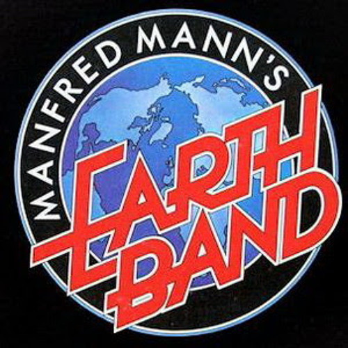

# Manfred Mann's Earth Band

## Artist Profile

After a very successful period in the 1960's with the pop group named Manfred Mann after him and a much less successful intermezzo in Jazz with Manfred Mann Chapter Three, the South-African born keyboardist Manfred Mann (real name Manfred Lubowitz) turned towards rock music.

In 1971 he formed Manfred Mann's Earth Band (MMEB). Mann's use of the Moog synthesizer was key to the sound of this band. MMEB had a very successful area during the mid 1970's and early 1980's but was disbanded by Mann in 1987 after being fed up with trying to produce hit records. He started a project which was based mostly on the music of Native American Indians named Manfred Mann's Plain Music and which released one album. After this Mann reformed the MMEB in 1991 and was starting again to release records with them occasionally but also to be a regular live band with extensive tours mostly in Europe until today.

Current members:
● Manfred Mann (2) – keyboards and vocals (1971–present)
● Mick Rogers – guitar and vocals (1971–1975, 1983–present)
● John Lingwood – drums (1979–1987, 2016–present)
● Steve Kinch – bass guitar (1986, 1991–present)
● Robert Hart – vocals (2011–present)

Former members:
● Chris Slade – drums (1971–1979)
● Colin Pattenden – bass (1971–1977)
● Chris Thompson – vocals and guitar (1975–1986, 1996–1999)
● Dave Flett – guitar (1975–1979)
● Pat King – bass (1977–1981; band lighting designer, 1991–2013)
● Steve Waller – guitar and vocals (1979–1983; died 2000)
● Geoff Britton – drums (1979)
● Trevor Rabin – guitar, producer (1980–1981, 1984)
● Matt Irving – bass (1982–1983)
● Shona Laing – vocals (1983)
● Noel McCalla – vocals (1991–2009, 2010)
● Clive Bunker – drums (1991–1996)
● John Trotter – drums (1996–2000)
● Richard Marcangelo – drums (2000–2002)
● Pete May – drums (2002)
● Geoff Dunn – drums (2002–2007)
● Jimmy Copley – drums and percussion (2007–2015; died 2017)
● Peter Cox – vocals (2009–2011)

## Artist Links

- [https://www.manfredmann.co.uk/](https://www.manfredmann.co.uk/)
- [https://www.facebook.com/manfredmannearthband](https://www.facebook.com/manfredmannearthband)
- [https://manfredmannsearthband.bandcamp.com/](https://manfredmannsearthband.bandcamp.com/)
- [https://www.youtube.com/channel/UC46BoyW19rtJe4q_Qz2lZOQ](https://www.youtube.com/channel/UC46BoyW19rtJe4q_Qz2lZOQ)
- [https://en.wikipedia.org/wiki/Manfred_Mann%27s_Earth_Band](https://en.wikipedia.org/wiki/Manfred_Mann%27s_Earth_Band)
- [http://www.progarchives.com/artist.asp?id=862](http://www.progarchives.com/artist.asp?id=862)
- [https://www.imdb.com/name/nm2503809/](https://www.imdb.com/name/nm2503809/)

## See also

- [Blinded By The Light](Blinded_By_The_Light.md)
