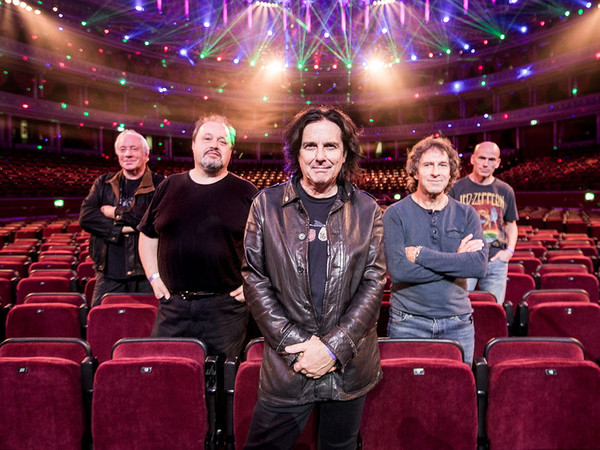

# Marillion

## Artist Profile

Marillion formed in Aylesbury, Buckinghamshire, England in 1979. Recording consistently since 1982, their output is generally regarded as comprising two distinct eras, that of original vocalist Fish who helmed the band at arguably their most popular (critically and commercially), and his replacement, former Europeans member Steve Hogarth, who joined the band after Fish's departure in 1989. The band's differing styles between the two vocalists has often been known to divide fans.

## Artist Links

- [https://www.marillion.com/](https://www.marillion.com/)
- [https://marillionofficial.bandcamp.com/](https://marillionofficial.bandcamp.com/)
- [https://www.facebook.com/MarillionOfficial/](https://www.facebook.com/MarillionOfficial/)
- [https://www.instagram.com/marillionofficial/](https://www.instagram.com/marillionofficial/)
- [http://www.progarchives.com/artist.asp?id=233](http://www.progarchives.com/artist.asp?id=233)
- [https://twitter.com/MarillionOnline](https://twitter.com/MarillionOnline)
- [https://en.wikipedia.org/wiki/Marillion](https://en.wikipedia.org/wiki/Marillion)
- [https://www.youtube.com/user/marilliononline](https://www.youtube.com/user/marilliononline)

## See also

- [Misplaced Childhood](Misplaced_Childhood.md)
