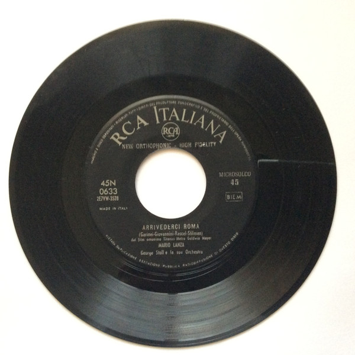

# Arrivederci Roma / It's The Loveliest Night Of The Year

By Mario Lanza

## Album Data

[Discogs URL](https://www.discogs.com/release/3965571-Mario-Lanza-Arrivederci-Roma-Its-The-Loveliest-Night-Of-The-Year)

- Label: RCA Italiana
- Formats: Vinyl, 7", 45 RPM, Single
- Genres: Classical, Romantic
- Rating: 2
- Released: 1957
- Year: 1957
- Release ID: 3965571
- Media condition: 
- Sleeve condition: 
- Speed: 
- Weight: 
- Notes: 

## Album Tracks

| **Position** | **Title** | **Duration** |
|--------------|-----------|--------------|
| A | **Arrivederci Roma** |  |
| B | **It's The Loveliest Night Of The Year** |  |

## Artist Roles

| **Name** | **Role** |
|----------|----------|
| **Georgie Stoll & His Orchestra** | Orchestra |

