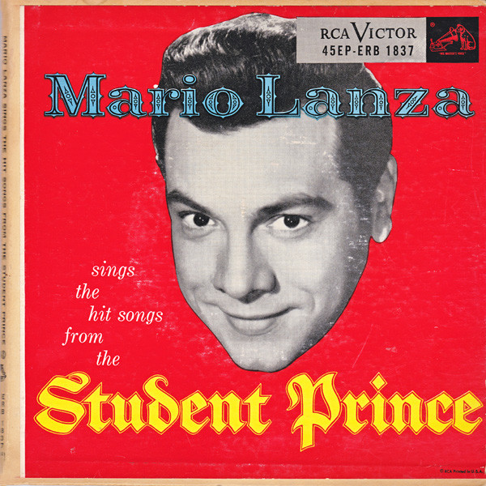

# Mario Lanza Sings The Hit Songs From The Student Prince

By Mario Lanza

## Album Data

[Discogs URL](https://www.discogs.com/release/4650914-Mario-Lanza-Mario-Lanza-Sings-The-Hit-Songs-From-The-Student-Prince)

- Label: RCA Victor Red Seal
RCA Victor Red Seal
- Formats: Vinyl, 7", 45 RPM, Album, EP
- Genres: Classical, Stage & Screen, Opera
- Rating: 3.5
- Released: 1954
- Year: 1954
- Release ID: 4650914
- Media condition: 
- Sleeve condition: 
- Speed: 
- Weight: 
- Notes: 

## Album Tracks

| **Position** | **Title** | **Duration** |
|--------------|-----------|--------------|
| A1 | **Orchestral Introduction** |  |
| A2 | **Serenade** |  |
| B1 | **Golden Days** |  |
| B2 | **Drink, Drink, Drink** |  |
| B3 | **Summertime In Heidelberg** |  |
| C1 | **Beloved** |  |
| C2 | **Gaudeamus Igitur** |  |
| D1 | **Deep In My Heart, Dear** |  |
| D2 | **I'll Walk With God** |  |

## Artist Roles

| **Name** | **Role** |
|----------|----------|
| **Constantine Callinicos** | Directed By [Chorus And Orchestra] |
| **Mario Lanza** | Tenor Vocals |

