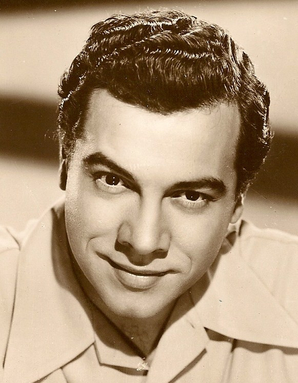

# Mario Lanza

## Artist Profile

Born: 31 January 1921, Philadelphia, Pennsylvania, USA
Died: 07 October 1959, Rome, Italy (aged 38)

Lanza was a classically-trained vocalist, who recorded everything- from operas, to musical comedy and to popular music.

Lanza grew up a handsome and athletic youth, helping out in his family's grocery store in Philadelphia. He gained his appreciation of music as a young boy, listening to his father's recordings of the great operatic singer Enrico Caruso, which he would accompany for the entertainment of customers and neighbors. When he was nineteen he began to receive voice-coaching for two years from the former operatic singer Irene Williams. Lanza was then awarded a scholarship to the Berkshire Music Center at Tanglewood, after auditioning for Serge Koussevitzky.

On completion of his scholarship he was drafted and eventually transferred to Special Services, appearing in two shows for the army as part of the 'Winged Victory' concerts created by Moss Hart, billed as 'The Caruso of the Air Force'.

Aged 26, Lanza performed at the Hollywood Bowl where he impressed three members of the audience from MGM, Ida Koverman, Louis B. Mayer and Kathryn Grayson. Mayer signed him to the film company and he made his debut in 'That Midnight Kiss' with Grayson and Ethel Barrymore, followed by a number of successful films. Lanza's most notable film was 'The Great Caruso', in 1951, in which he played the part of the heralded singer who had provided the inspiration for his career in operatic entertainment.

## Artist Links

- [http://www.lanzalegend.com/](http://www.lanzalegend.com/)
- [http://en.wikipedia.org/wiki/Mario_Lanza](http://en.wikipedia.org/wiki/Mario_Lanza)

## See also

- [Arrivederci Roma / It's The Loveliest Night Of The Year](Arrivederci_Roma_-_Its_The_Loveliest_Night_Of_The_Year.md)
- [Mario Lanza Sings The Hit Songs From The Student Prince](Mario_Lanza_Sings_The_Hit_Songs_From_The_Student_Prince.md)
