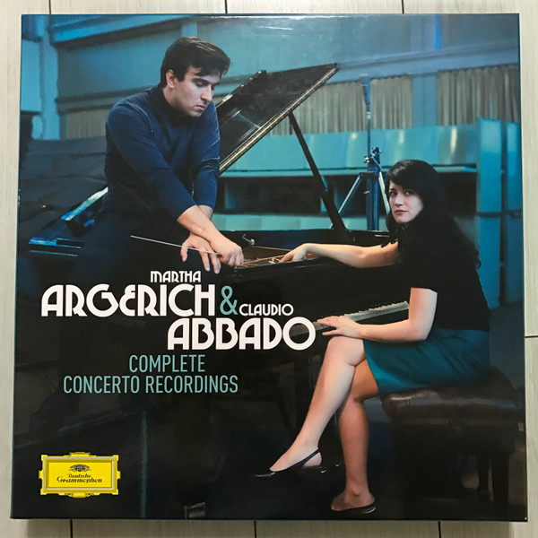

# Complete Concerto Recordings

By Martha Argerich

## Album Data

[Discogs URL](https://www.discogs.com/release/7935882-Martha-Argerich-Claudio-Abbado-Complete-Concerto-Recordings)

- Label: Deutsche Grammophon
- Formats: Vinyl
Box Set, LP, Compilation, Limited Edition, Remastered
- Genres: Classical, Classical, Romantic
- Rating: 4.76
- Released: 2015
- Year: 2014
- Release ID: 7935882
- Media condition: 
- Sleeve condition: 
- Speed: 
- Weight: 
- Notes: 

## Album Tracks

| **Position** | **Title** | **Duration** |
|--------------|-----------|--------------|
|  | **LP1** | 48:12 |
|  | **LP 2** | 55:34 |
|  | **LP 3** | 32:00 |
|  | **LP 4** | 63:54 |
|  | **LP 5** | 61:42 |
|  | **LP 6** | 44:14 |

## Artist Roles

| **Name** | **Role** |
|----------|----------|
| **Claudio Abbado** | Conductor |
| **Martha Argerich** | Piano |

