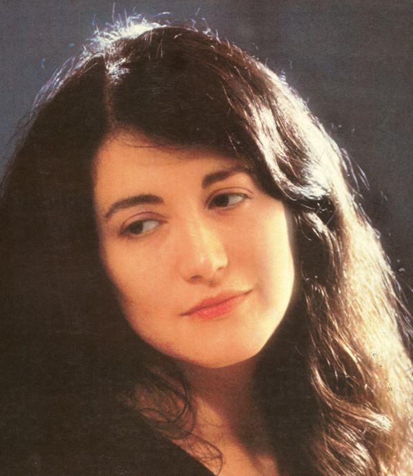

# Martha Argerich

## Artist Profile

Martha Argerich (b. 1941) is an Argentine pianist, widely regarded as one of the greatest masters of the instrument of the late XX century. She was born in Buenos Aires to the family of Catalonian descendants and Jewish immigrants from the Russian Empire. Martha started playing the piano at the age of three and began her studies with Vincenzo Scaramuzza two years later. In 1949, an eight-year-old Argerich gave her debut concert.

In 1955, Argerichs moved to Austria, so Martha began her studies with Friedrich Gulda. This opportunity was provided by Juan Domingo Perón, the President of Argentina, who appointed her parents to diplomatic posts at the Argentinian Embassy in Vienna. Martha Argerich later studied with Stefan Askenase and had been coached briefly by Madeleine Lipatti, Abbey Simon, and Nikita Magaloff.

At the age of sixteen, she won both Geneva International Music Competition and Ferruccio Busoni International Competition within three weeks of each other in 1957. Martha rose to international fame after winning the 7th International Chopin Piano Competition in Warsaw in 1965, at the age of 24, also debuting in the United States the same year.

Argerich has been actively promoting younger pianists, both through her annual Argerich Music Festival and by appearing on a jury at various international competitions. When Ivo Pogorelich dropped out the third round of the International Chopin Piano Competition in 1980 in Warsaw, Argerich proclaimed him a genius and left the jury in protest. Some of her notable protégés include Gabriela Montero, Mauricio Vallina, Sergio Tiempo, and Christopher Falzone.

Martha was married three times, to a Chinese composer and conductor Robert Chen (1963–1964), Swiss composer Charles Dutoit (1969–1973), and an American pianist Stephen Bishop-Kovacevich (the 1970s). She has a daughter from each husband: violist Lida Chen, a journalist Annie Dutoit, and a film director and photographer Stéphanie Argerich.

## Artist Links

- [https://web.archive.org/web/20120416185536/http://www.rsi.ch/argerich/](https://web.archive.org/web/20120416185536/http://www.rsi.ch/argerich/)
- [http://www.andrys.com/argerich.html](http://www.andrys.com/argerich.html)
- [https://en.wikipedia.org/wiki/Martha_Argerich](https://en.wikipedia.org/wiki/Martha_Argerich)

## See also

- [Complete Concerto Recordings](Complete_Concerto_Recordings.md)
