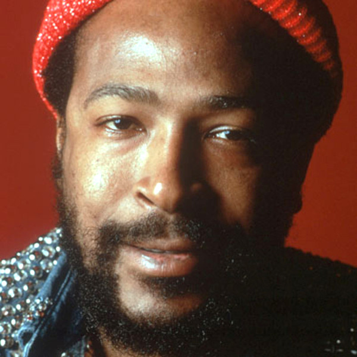

# Marvin Gaye

## Artist Profile

American singer-songwriter and musician with a three-octave vocal range, born April 2, 1939 in Washington, D.C., USA, died April 1, 1984 in Los Angeles, California, USA when he was shot by his father Marvin Gay, Sr.
Inducted into Rock And Roll Hall of Fame in 1987 (Performer). Starting as a member of the The Moonglows in the late fifties, he ventured into a solo career after the group disbanded in 1960 signing with the Tamla subsidiary of Motown Records.
Brother of Frankie Gaye and father of Nona Gaye.

## Artist Links

- [https://en.wikipedia.org/wiki/Marvin_Gaye](https://en.wikipedia.org/wiki/Marvin_Gaye)
- [https://www.whosampled.com/Marvin-Gaye/](https://www.whosampled.com/Marvin-Gaye/)
- [https://genius.com/artists/Marvin-gaye](https://genius.com/artists/Marvin-gaye)
- [https://www.imdb.com/name/nm0310848/](https://www.imdb.com/name/nm0310848/)
- [https://www.ibdb.com/broadway-cast-staff/marvin-gaye-73056](https://www.ibdb.com/broadway-cast-staff/marvin-gaye-73056)

## See also

- [What's Going On](Whats_Going_On.md)
