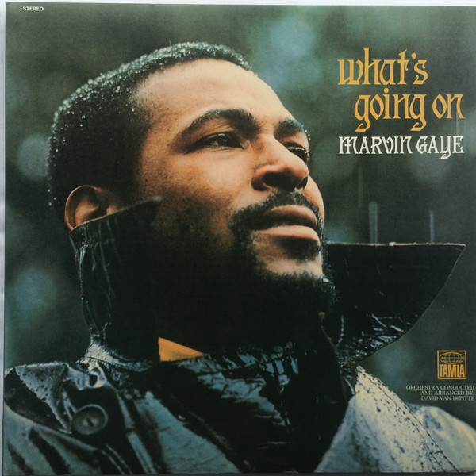

# What's Going On

By Marvin Gaye

## Album Data

[Discogs URL](https://www.discogs.com/release/3005073-Marvin-Gaye-Whats-Going-On)

- Label: Motown
- Formats: Vinyl
CD
CD
All Media, LP, Album, Compilation, Deluxe Edition
- Genres: Funk / Soul
- Rating: 4.86
- Released: 2011-05-17
- Year: 1971
- Release ID: 3005073
- Media condition: 
- Sleeve condition: 
- Speed: 
- Weight: 
- Notes: 

## Album Tracks

| **Position** | **Title** | **Duration** |
|--------------|-----------|--------------|
|  | **What's Going On: The Original "Detroit Mix"** |  |
| LP-A1 | **What's Going On** |  |
| LP-A2 | **What's Happening Brother** |  |
| LP-A3 | **Flyin' High (In The Friendly Sky)** |  |
| LP-A4 | **Save The Children** |  |
| LP-A5 | **God Is Love** |  |
| LP-A6 | **Mercy Mercy Me (The Ecology)** |  |
| LP-B1 | **Right On** |  |
| LP-B2 | **Wholy Holy** |  |
| LP-B3 | **Inner City Blues (Make Me Wanna Holler)** |  |
|  | **What's Going On: Original Album Remastered** |  |
| CD1-1 | **What's Going On** |  |
| CD1-2 | **What's Happening Brother** |  |
| CD1-3 | **Flyin' High (In The Friendly Sky)** |  |
| CD1-4 | **Save The Children** |  |
| CD1-5 | **God Is Love** |  |
| CD1-6 | **Mercy Mercy Me (The Ecology)** |  |
| CD1-7 | **Right On** |  |
| CD1-8 | **Wholy Holy** |  |
| CD1-9 | **Inner City Blues (Make Me Wanna Holler)** |  |
|  | **Bonus Tracks** |  |
| CD1-10 | **What's Going On (Unreleased Original Single Mix)** |  |
| CD1-11 | **Head Title A.K.A. Distant Lover (Demo Version - Original Master)** |  |
| CD1-12 | **Symphony (Demo Version)** |  |
| CD1-13 | **I Love The Ground You Walk On (Instrumental)** |  |
| CD1-14 | **What's Going On (Mono Single Version)** |  |
| CD1-15 | **God Is Love (Single Version)** |  |
| CD1-16 | **Mercy Mercy Me (The Ecology) 	(Mono Single Version)** |  |
| CD1-17 | **Sad Tomorrows (Mono Single Version)** |  |
| CD1-18 | **Inner City Blues (Make Me Wanna Holler) (Mono Single Version)** |  |
| CD1-19 | **Wholy Holy  (Mono Single Version)** |  |
|  | **The Detroit Instrumental Sessions And More** |  |
| CD2-1 | **Checking Out (Double Clutch)** |  |
| CD2-2 | **Chained** |  |
| CD2-3 | **Country Stud** |  |
| CD2-4 | **Help The People** |  |
| CD2-5 | **Running From Love (Version 1)** |  |
| CD2-6 | **Daybreak** |  |
| CD2-7 | **Doing My Thing** |  |
| CD2-8 | **"T" Stands For Time** |  |
| CD2-9 | **Jesus Is Our Love Song** |  |
| CD2-10 | **Funky Nation** |  |
| CD2-11 | **Infinity** |  |
| CD2-12 | **Mandota** |  |
| CD2-13 | **Struttin' The Blues** |  |
| CD2-14 | **Running From Love (Version 2 With Strings)** |  |
| CD2-15 | **I'm Going Home (Move)** |  |
| CD2-16 | **You're The Man (Parts 1 And 2 - Original Mono Single Version)** |  |
| CD2-17 | **You're The Man (Alternate Version 1)** |  |
| CD2-18 | **You're The Man (Alternate Version 2)** |  |

## Artist Roles

| **Name** | **Role** |
|----------|----------|
| **Marvin Gaye** | Producer |

