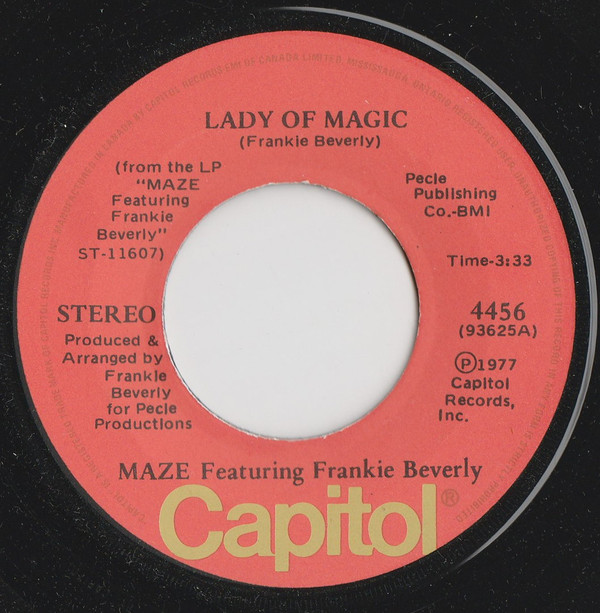

# Lady Of Magic

By Maze Featuring Frankie Beverly

## Album Data

[Discogs URL](https://www.discogs.com/release/3039465-Maze-Featuring-Frankie-Beverly-Lady-Of-Magic)

- Label: Capitol Records
- Formats: Vinyl, 7", 45 RPM, Single, Stereo
- Genres: Funk / Soul, Soul, Funk
- Rating: 4.33
- Released: 1977
- Year: 1977
- Release ID: 3039465
- Media condition: 
- Sleeve condition: 
- Speed: 
- Weight: 
- Notes: 

## Album Tracks

| **Position** | **Title** | **Duration** |
|--------------|-----------|--------------|
| A | **Lady Of Magic** | 3:33 |
| B | **Time Is On My Side** | 5:19 |

## Artist Roles

| **Name** | **Role** |
|----------|----------|
| **Ken Perry** | Lacquer Cut By |
| **Frankie Beverly** | Producer, Arranged By, Written-By |

