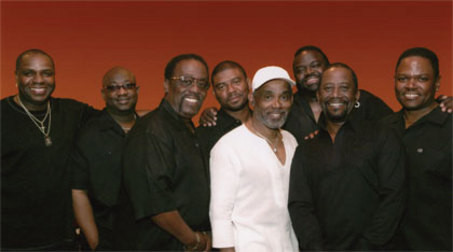

# Maze Featuring Frankie Beverly

## Artist Profile

The sound is distinctive -- passionate, creative, original, soulful, honest and powerful. For nearly thirty years Frankie Beverly and Maze have created a unique sound and become one of the most influential groups in modern history. 

"We've made it this far because we love and respect ourselves and our fans. But, most importantly, we believe in what we do," remarks Frankie. The journey began when Frankie relocated from his hometown of Philadelphia to San Francisco and formed Maze. In 1976, he released his first album, Maze Featuring Frankie Beverly which yielded a string of hit singles, including "Lady of Magic" and "Workin' Together." 

The 80's brought the release of the best-selling albums, Golden Time of Day, Inspiration, Joy and Pain, containing a list of chart-topping singles including "Travelin' Man," "Feel That You're Feeling," "Joy and Pain," "Look in Your Eyes" and "Southern Girl," to name a few. The group gained worldwide appeal with its legendary sold-out live appearances, and released the deluxe album Live in New Orleans which captured the energy, excitement and electricity of a Maze stage show and offered a fourth side of new studio material which included the hit single "Running Away". 

In 1983, with the release of We Are One, Frankie Beverly & Maze solidified their international standing with such hits as the title track "Never Let You Down", "I Love You Too Much" and "Love is the Key." As the 80's came to a close, the group released Can't Stop the Love and a second in-concert package, Maze Featuring Frankie Beverly Live in L.A., which served both as a retrospective of the group's remarkable career to date and a fitting close to the first chapter of the Maze legend. 

With a change of record label and shifts in the group's line-up a new era was launched for Frankie Beverly & Maze. "We wanted to emphasize our strengths, bring together the elements that have always been a part of our music and really focus on them," continued Frankie. The band released Silky Soul, one of their most successful albums, which included the smash singles, "I Can't Get Over You" and the title track. 

After a solid year of touring North America and Europe, the group took a break to recharge their creative juices. "When you're trying to do the best you can..to give the people everything you've got, you need to be patient," Frankie emphasized. With anticipation and excitement, the group released Back to Basics which captured the passionate, electrifying essence of the group, and included the hit singles, "Laid Back Girl," "The Morning After" and "What Goes Up." 

In between preparing material for the release of their third Warner Bros. album and a Christmas album the group continues to be one of the most requested at music festivals throughout the world drawing major crowds. As a headlining act, Frankie Beverly and Maze have been instrumental in giving exposure to several new recording artists, before they became household names, including Toni Braxton, Regina Belle and Anita Baker, to name a few. 

Recently Maze released a 20-track double-CD "Anthology" of the most popular and successful songs by Frankie Beverly's smooth soul/R&B group Maze makes an almost self-evident point about the far-too-usual treatment of the deserved in the pop music game. The All Music Guide wrote, "Frankie Beverly and Maze may be the ultimate urban contemporary group, though they're much more soulful and funky than many of their counterparts." 

Although the group has never won any awards they continue to attract sold-out audiences giving them the title "best kept secret in the industry". 

## Artist Links

- [http://www.maze-inc.com](http://www.maze-inc.com)
- [http://www.mazemuze.com](http://www.mazemuze.com)
- [http://www.myspace.com/fbm6142006](http://www.myspace.com/fbm6142006)
- [http://en.wikipedia.org/wiki/Frankie_Beverly_%26_Maze](http://en.wikipedia.org/wiki/Frankie_Beverly_%26_Maze)
- [http://www.whosampled.com/Maze-Featuring-Frankie-Beverly/](http://www.whosampled.com/Maze-Featuring-Frankie-Beverly/)
- [http://www.allmusic.com/album/maze-featuring-frankie-beverly-mw0000653251](http://www.allmusic.com/album/maze-featuring-frankie-beverly-mw0000653251)

## See also

- [Lady Of Magic](Lady_Of_Magic.md)
