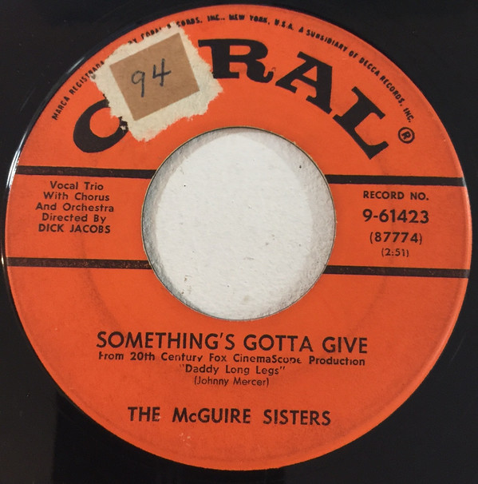

# Something's Gotta Give / Rhythm 'N' Blues

By McGuire Sisters

## Album Data

[Discogs URL](https://www.discogs.com/release/8462916-The-McGuire-Sisters-Somethings-Gotta-Give-Rhythm-N-Blues)

- Label: Coral
- Formats: Vinyl, 7", 45 RPM, Single
- Genres: Pop, Stage & Screen, Vocal
- Rating: 3.5
- Released: 1955
- Year: 1955
- Release ID: 8462916
- Media condition: 
- Sleeve condition: 
- Speed: 
- Weight: 
- Notes: 

## Album Tracks

| **Position** | **Title** | **Duration** |
|--------------|-----------|--------------|
| A | **Something's Gotta Give** | 2:51 |
| B | **Rhythm 'N' Blues (Mama's Got The Rhythm-Papa's Got The Blues)** | 2:33 |

## Artist Roles

| **Name** | **Role** |
|----------|----------|
| **Dick Jacobs** | Chorus Master, Orchestra |

