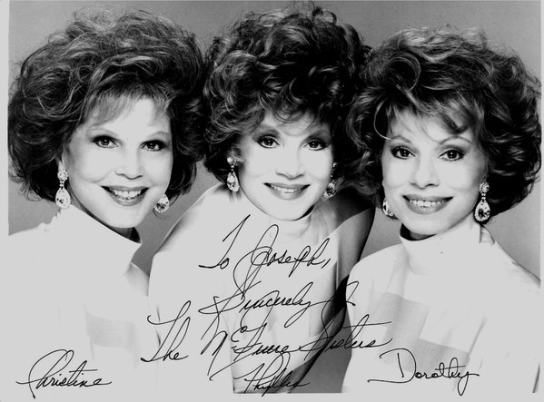

# McGuire Sisters

## Artist Profile

The McGuire Sisters were a singing trio in American popular music. 
The group was composed of three sisters; 
Christine McGuire (born July 30, 1926 – died December 28, 2018), 
Dorothy McGuire (born February 13, 1928 – died September 8, 2012), and 
Phyllis McGuire (born February 14, 1931 – died December 30, 2020). 
Among their most popular songs are "Sincerely" and "Sugartime / Banana Split".

## Artist Links

- [http://en.wikipedia.org/wiki/The_McGuire_Sisters](http://en.wikipedia.org/wiki/The_McGuire_Sisters)
- [http://www.vocalgroup.org/inductees/the_mcguire_sisters.html](http://www.vocalgroup.org/inductees/the_mcguire_sisters.html)
- [https://www.imdb.com/name/nm1311370/](https://www.imdb.com/name/nm1311370/)

## See also

- [Something's Gotta Give / Rhythm 'N' Blues](Somethings_Gotta_Give_-_Rhythm_N_Blues.md)
