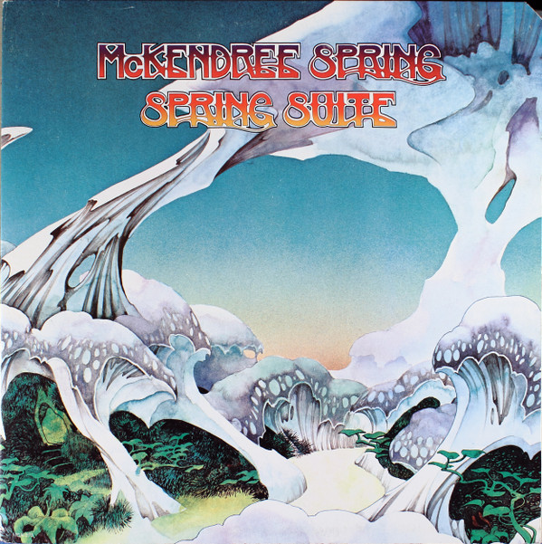

# Spring Suite

By McKendree Spring

## Album Data

[Discogs URL](https://www.discogs.com/release/2765002-McKendree-Spring-Spring-Suite)

- Label: MCA Records
- Formats: Vinyl, LP, Album, Stereo
- Genres: Rock, Pop, Folk, World, & Country, Folk Rock
- Rating: 3.81
- Released: 1973
- Year: 1973
- Release ID: 2765002
- Media condition: 
- Sleeve condition: 
- Speed: 
- Weight: 
- Notes: 

## Album Tracks

| **Position** | **Title** | **Duration** |
|--------------|-----------|--------------|
| A1 | **Equinox (Instrumental)** | 1:46 |
| A2 | **Winter** | 3:38 |
| A3 | **I Was Born** | 4:25 |
| A4 | **The Madman** | 3:44 |
| A5 | **The Girl** | 4:04 |
| B1 | **Today's The Day** | 3:31 |
| B2 | **The Storm** | 2:43 |
| B3 | **Growing** | 3:52 |
| B4 | **Spring** | 4:09 |

## Artist Roles

| **Name** | **Role** |
|----------|----------|
| **Fran McKendree** | Acoustic Guitar, Vocals |
| **McKendree Spring** | Arranged By, Performer |
| **Chris Bishop (5)** | Bass [Fender], Vocals |
| **Roger Dean (4)** | Cover [Designed And Drawn] |
| **Martin Slutsky** | Electric Guitar |
| **Martin Lennard** | Engineer |
| **Michael Brovsky** | Producer |
| **Michael Dreyfuss** | Violin [Electric], Viola [Electric], Synthesizer [Arp And Moog] |

