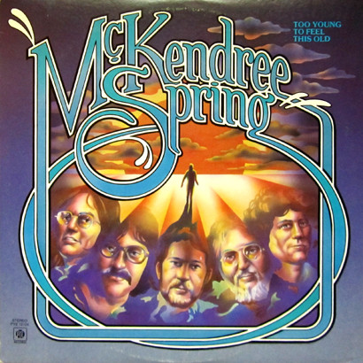

# Too Young To Feel This Old

By McKendree Spring

## Album Data

[Discogs URL](https://www.discogs.com/release/1945337-McKendree-Spring-Too-Young-To-Feel-This-Old)

- Label: Pye Records
- Formats: Vinyl, LP, Album
- Genres: Rock, Folk, World, & Country, Folk Rock
- Rating: 3.95
- Released: 1976
- Year: 1976
- Release ID: 1945337
- Media condition: 
- Sleeve condition: 
- Speed: 
- Weight: 
- Notes: 

## Album Tracks

| **Position** | **Title** | **Duration** |
|--------------|-----------|--------------|
| A1 | **Too Young To Feel This Old** | 3:21 |
| A2 | **I'm In Love** | 3:06 |
| A3 | **(She's A Housewife) No More Rock 'N' Roll** | 3:07 |
| A4 | **Take It From The Heart** | 2:52 |
| A5 | **Clown** | 2:56 |
| B1 | **Run Like The Wind** | 2:49 |
| B2 | **My Kind Of Life** | 3:16 |
| B3 | **Oh, What A Feeling** | 2:50 |
| B4 | **I'm Gonna Lose That Game Again** | 2:47 |
| B5 | **Divide And Concord** | 6:26 |

## Artist Roles

| **Name** | **Role** |
|----------|----------|
| **Chris Bishop (5)** | Bass, Backing Vocals |
| **Carson Michaels** | Drums, Backing Vocals |
| **Martin Rushent** | Engineer |
| **Martin Slutsky** | Guitar |
| **Fran McKendree** | Guitar, Vocals |
| **Bob Ludwig** | Mastered By |
| **Warren Bernhardt** | Piano, Organ |
| **Mark London** | Producer |
| **Michael Dreyfuss** | Violin, Viola |

