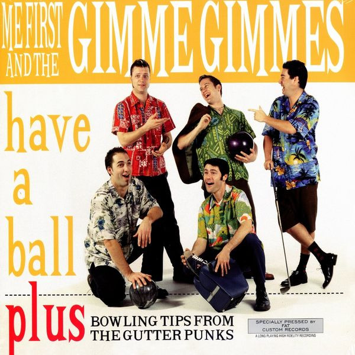

# Have A Ball

By Me First And The Gimme Gimmes

## Album Data

[Discogs URL](https://www.discogs.com/release/814879-Me-First-And-The-Gimme-Gimmes-Have-A-Ball)

- Label: Fat Wreck Chords
- Formats: Vinyl, LP, Album
- Genres: Rock, Surf, Punk
- Rating: 4.3
- Released: 1997-07-29
- Year: 1997
- Release ID: 814879
- Media condition: 
- Sleeve condition: 
- Speed: 
- Weight: 
- Notes: 

## Album Tracks

| **Position** | **Title** | **Duration** |
|--------------|-----------|--------------|
| A1 | **Danny's Song** |  |
| A2 | **Leaving On A Jet Plane** |  |
| A3 | **Me & Julio Down By The Schoolyard** |  |
| A4 | **One Tin Soldier** |  |
| A5 | **Uptown Girl** |  |
| A6 | **I Am A Rock** |  |
| B1 | **Sweet Caroline** |  |
| B2 | **Seasons In The Sun** |  |
| B3 | **Fire And Rain** |  |
| B4 | **Nobody Does It Better** |  |
| B5 | **Mandy** |  |
| B6 | **Rocket Man** |  |

## Artist Roles

| **Name** | **Role** |
|----------|----------|
| **Fat Mike (2)** | Bass |
| **Dave Raun** | Drums |
| **Jake Jackson (2)** | Guitar |
| **Joey Cape** | Guitar |
| **Spike Slawson** | Vocals |

