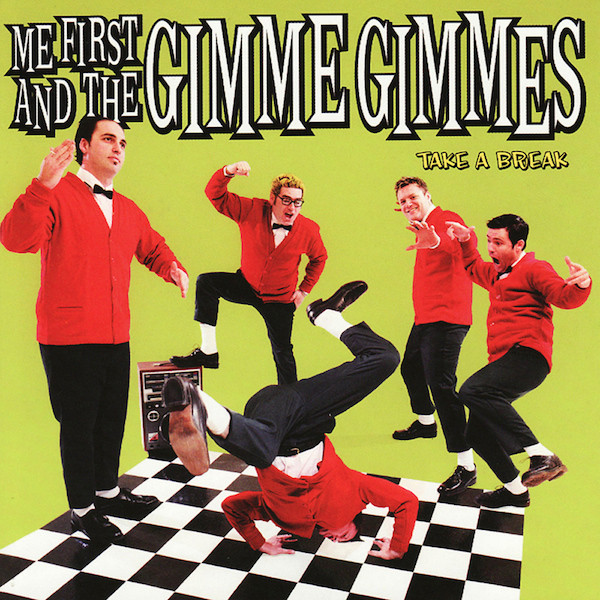

# Take A Break

By Me First And The Gimme Gimmes

## Album Data

[Discogs URL](https://www.discogs.com/release/814858-Me-First-And-The-Gimme-Gimmes-Take-A-Break)

- Label: Fat Wreck Chords
- Formats: Vinyl, LP, Album
- Genres: Rock, Surf, Punk
- Rating: 4.28
- Released: 2003
- Year: 2003
- Release ID: 814858
- Media condition: 
- Sleeve condition: 
- Speed: 
- Weight: 
- Notes: 

## Album Tracks

| **Position** | **Title** | **Duration** |
|--------------|-----------|--------------|
| A1 | **Where Do Broken Hearts Go** |  |
| A2 | **Hello** |  |
| A3 | **End Of The Road** |  |
| A4 | **Ain't No Sunshine** |  |
| A5 | **Nothing Compares 2 U** |  |
| A6 | **Crazy** |  |
| A7 | **Isn't She Lovely** |  |
| B1 | **I Believe I Can Fly** |  |
| B2 | **Oh Girl** |  |
| B3 | **I'll Be There** |  |
| B4 | **Mona Lisa** |  |
| B5 | **Save The Best For Last** |  |
| B6 | **Natural Woman** |  |

## Artist Roles

| **Name** | **Role** |
|----------|----------|
| **3AM.net** | Artwork By [Design], Photography [Additional] |
| **Adam Krammer** | Engineer [Additional, Assistant] |
| **Eddy Schreyer** | Mastered By |
| **Mona Whetzel** | Other [Styling Assistant] |
| **Lisa Brownlee** | Other [Styling] |
| **Jay Blakesberg** | Photography |
| **Ryan Greene** | Recorded By, Mixed By |

