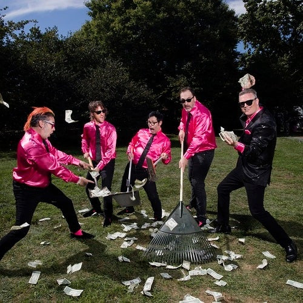

# Me First And The Gimme Gimmes

## Artist Profile

Punk rock supergroup that exclusively performs cover songs, formed in 1995 by musicians on the Fat Wreck Chords roster. They reinterpret popular songs in a punk rock style, often working in musical interpretations of existing punk songs. Each of their albums has a different musical theme. The bulk of their output has been on Fat Wreck Chords, with some singles and EPs released on other independent labels.

The band was formed by bassist "Fat Mike" Burkett (NOFX), guitarists Joey Cape (Lagwagon) and Chris Shiflett (then of No Use For A Name, using the alias "Jake Jackson"), drummer Dave Raun (then of Rich Kids On LSD, soon to join Lagwagon), and singer Spike Slawson (who worked in the Fat Wreck Chords warehouse and later joined Swingin' Utters). Their early releases were 7" singles of songs from the 1960s/1970s "AM Gold" era, named after the artists being covered: "Denver" for John Denver, "Billy" for Billy Joel, etc. Several of these songs, along with a few new recordings, comprised their first studio album, 1997's Have A Ball. Are A Drag followed in 1999, consisting of showtunes from musicals. Also that year, Shiflett left No Use For A Name and joined the Foo Fighters.

2001's Blow In The Wind covered 1960s pop hits, while 2003's Take A Break tackled the R&B genre. A live album, Ruin Jonny's Bar Mitzvah, followed in 2004; recorded at an actual bar mitzvah, it found the band covering karaoke favorites. In 2006 the band released Love Their Country on which they covered country songs; it was accompanied by the "Square Dance Series" of square-shaped 7"s. Have Another Ball was released in 2008, consisting of songs from the Have A Ball era, most of them previously released on 7"s.

The EPs Go Down Under and Sing In Japanese were released in 2011 to coincide with the band's tours of Australia and Japan, consisting of covers of artists from those countries. For their 2014 album Are We Not Men? We Are Diva!, they covered songs made famous by "diva" singers. The compilation Rake It In: The Greatestest Hits was released in 2018.

Due to the members' other commitments, many fill-in musicians have performed with Me First And The Gimme Gimmes on tour. Examples include Brian Baker, Schiflett's brother Scott Shiflett, Eric Melvin, Adam Stern, Mark Mortensen, Grant McIntire, Barry Dalive, Warren Fitzgerald, Lindsay McDougall, Chris Cheney, Stacey Dee, Andrew Pinching, John Wickersham, and John Reis. Since 2014, Burkett has seldom performed live with the group; Jay Bentley and C.J. Ramone have often served as touring bassists in his stead. In 2019, Chris Shiflett stated that he was no longer involved with the group.

## Artist Links

- [https://mefirstandthegimmegimmes.com](https://mefirstandthegimmegimmes.com)
- [https://www.facebook.com/gimmegimmes](https://www.facebook.com/gimmegimmes)

## See also

- [Have A Ball](Have_A_Ball.md)
- [Take A Break](Take_A_Break.md)
