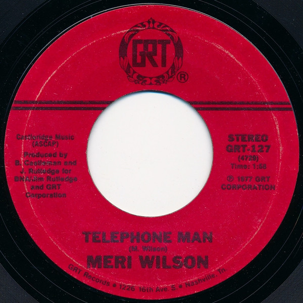

# Telephone Man

By Meri Wilson

## Album Data

[Discogs URL](https://www.discogs.com/release/1945827-Meri-Wilson-Telephone-Man)

- Label: GRT
- Formats: Vinyl, 7", 45 RPM, Single, Styrene
- Genres: Jazz, Pop, Vocal
- Rating: 4.07
- Released: 1977
- Year: 1977
- Release ID: 1945827
- Media condition: 
- Sleeve condition: 
- Speed: 
- Weight: 
- Notes: 

## Album Tracks

| **Position** | **Title** | **Duration** |
|--------------|-----------|--------------|
| A | **Telephone Man** | 1:58 |
| B | **Itinerary** | 2:51 |

## Artist Roles

| **Name** | **Role** |
|----------|----------|
| **Boomer Castleman** | Producer [Produced By] |
| **Jim Rutledge** | Producer [Produced By] |
| **Meri Wilson** | Written-By |

