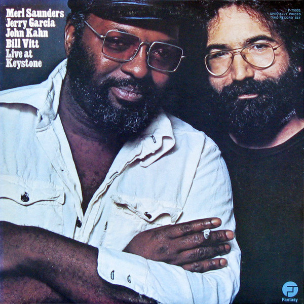

# Live At Keystone

By Merl Saunders

## Album Data

[Discogs URL](https://www.discogs.com/release/1511121-Merl-Saunders-Jerry-Garcia-John-Kahn-Bill-Vitt-Live-At-Keystone)

- Label: Fantasy
- Formats: Vinyl, LP, Album
- Genres: Rock, Funk / Soul, Blues Rock, Funk, Soul-Jazz, Jazz-Rock
- Rating: 4.44
- Released: 1973
- Year: 1973
- Release ID: 1511121
- Media condition: 
- Sleeve condition: 
- Speed: 
- Weight: 
- Notes: 

## Album Tracks

| **Position** | **Title** | **Duration** |
|--------------|-----------|--------------|
| A1 | **Finders Keepers, Losers Weepers** | 6:38 |
| A2 | **Positively 4th Street** | 7:45 |
| A3 | **The Harder They Come** | 6:20 |
| B1 | **It Takes A Lot To Laugh, It Takes A Train To Cry** | 7:03 |
| B2 | **Space** | 3:53 |
| B3 | **It's No Use** | 9:34 |
| C1 | **That's All Right, Mama** | 4:18 |
| C2 | **My Funny Valentine** | 18:06 |
| D1 | **Someday Baby** | 10:13 |
| D2 | **Like A Road** | 10:58 |

## Artist Roles

| **Name** | **Role** |
|----------|----------|
| **Tony Lane (2)** | Art Direction, Design |
| **John Kahn** | Bass |
| **Bill Vitt** | Drums |
| **Jerry Garcia** | Guitar, Vocals |
| **Merl Saunders** | Keyboards |
| **Annie Leibovitz** | Photography By |
| **Steven Shames** | Photography By [Back Cover] |
| **Bill Vitt** | Producer |
| **Jerry Garcia** | Producer |
| **John Kahn** | Producer |
| **Merl Saunders** | Producer |
| **Betty Cantor** | Recorded By |
| **Rex Jackson** | Recorded By |

