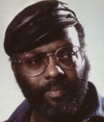

# Merl Saunders

## Artist Profile

American keyboardist and composer. Closely associated with Jerry Garcia and later with jam bands such as Phish and The String Cheese Incident.
b. February 14, 1934, San Mateo, California, USA
d. October 24, 2008, San Francisco, California, USA

## Artist Links

- [http://en.wikipedia.org/wiki/Merl_Saunders](http://en.wikipedia.org/wiki/Merl_Saunders)

## See also

- [Live At Keystone](Live_At_Keystone.md)
