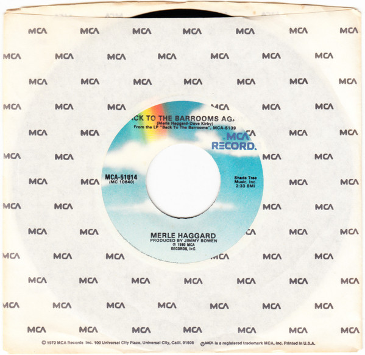

# Back To The Barrooms Again / I Think I'll Just Stay Here And Drink

By Merle Haggard

## Album Data

[Discogs URL](https://www.discogs.com/release/7702545-Merle-Haggard-Back-To-The-Barrooms-Again-I-Think-Ill-Just-Stay-Here-And-Drink)

- Label: MCA Records
- Formats: Vinyl, 7", 45 RPM, Single
- Genres: Folk, World, & Country, Country
- Rating: 2.5
- Released: 1980
- Year: 1980
- Release ID: 7702545
- Media condition: 
- Sleeve condition: 
- Speed: 
- Weight: 
- Notes: 

## Album Tracks

| **Position** | **Title** | **Duration** |
|--------------|-----------|--------------|
| A | **Back To The Barrooms Again** | 2:33 |
| B | **I Think I'll Just Stay Here And Drink** | 4:30 |

## Artist Roles

| **Name** | **Role** |
|----------|----------|
| **Jimmy Bowen** | Producer |

