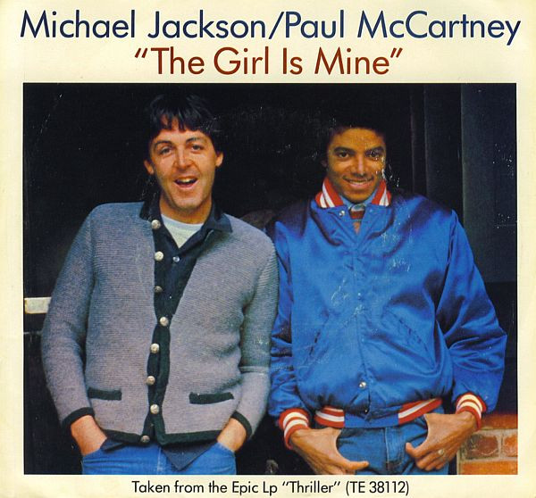

# The Girl Is Mine

By Michael Jackson

## Album Data

[Discogs URL](https://www.discogs.com/release/1000783-Michael-Jackson-Paul-McCartney-The-Girl-Is-Mine)

- Label: Epic
- Formats: Vinyl, 7", 45 RPM, Single, Styrene
- Genres: Funk / Soul, Pop, Ballad
- Rating: 3.91
- Released: 1982-10-25
- Year: 1982
- Release ID: 1000783
- Media condition: 
- Sleeve condition: 
- Speed: 
- Weight: 
- Notes: 

## Album Tracks

| **Position** | **Title** | **Duration** |
|--------------|-----------|--------------|
| A | **The Girl Is Mine** | 3:41 |
| B | **Can't Get Outta The Rain** | 4:02 |

## Artist Roles

| **Name** | **Role** |
|----------|----------|
| **Brian Gardner** | Mastered By [Etched ❀] |
| **Linda McCartney** | Photography By |
| **Quincy Jones** | Producer |

