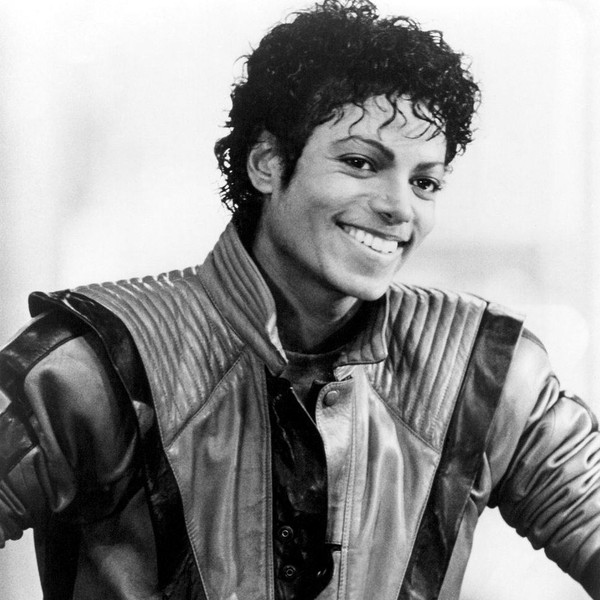

# Michael Jackson

## Artist Profile

American singer, dancer, entertainer, songwriter, producer and recording artist.

Born: 29 August 1958 in Gary, Indiana, USA.
Died: 25 June 2009 in Los Angeles, California, USA (aged 50).

Known affectionately as the "King Of Pop", Jackson was a singer, dancer, musician, music producer, writer, entertainer, singer-songwriter, choreographer, record producer, recording artist, poet, arranger, businessman, philanthropist, actor and voice artist. He is one of the most celebrated and influential music artists of all time.
 
Jackson began his career as the youngest member of The Jackson 5 and started his solo recording career in 1971. Brother of recording artists Jackie Jackson, Janet Jackson, Jermaine Jackson, La Toya Jackson, Marlon Jackson, Randy Jackson, Rebbie Jackson & Tito Jackson, as well as uncle of 3T.

Inducted into Rock And Roll Hall of Fame in 2001 (as performer).

On June 25, 2009, Michael Jackson died of acute propofol and benzodiazepine intoxication at his home on North Carolwood Drive in the Holmby Hills neighborhood of Los Angeles, CA. His personal physician, Conrad Murray, said he had found Jackson in his room, not breathing and with a barely detectable pulse, and that he administered CPR on Jackson to no avail. After a call was placed to 9-1-1 at 12:21 p.m., Jackson was treated by paramedics at the scene and was later pronounced dead at the Ronald Reagan UCLA Medical Center.

## Artist Links

- [http://www.michaeljackson.com](http://www.michaeljackson.com)
- [http://www.britannica.com/biography/Michael-Jackson](http://www.britannica.com/biography/Michael-Jackson)
- [http://www.facebook.com/michaeljackson](http://www.facebook.com/michaeljackson)
- [http://genius.com/artists/Michael-jackson](http://genius.com/artists/Michael-jackson)
- [http://www.imdb.com/name/nm0001391](http://www.imdb.com/name/nm0001391)
- [http://www.instagram.com/michaeljackson](http://www.instagram.com/michaeljackson)
- [http://twitter.com/michaeljackson](http://twitter.com/michaeljackson)
- [http://en.wikipedia.org/wiki/Michael_Jackson](http://en.wikipedia.org/wiki/Michael_Jackson)
- [http://www.youtube.com/user/MichaelJacksonVEVO](http://www.youtube.com/user/MichaelJacksonVEVO)

## See also

- [The Girl Is Mine](The_Girl_Is_Mine.md)
