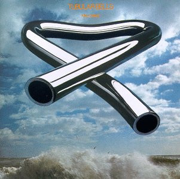

# Tubular Bells

By Mike Oldfield

## Album Data

[Discogs URL](https://www.discogs.com/release/3020834-Mike-Oldfield-Tubular-Bells)

- Label: Virgin
- Formats: Vinyl, LP, Album
- Genres: Electronic, Experimental, Ambient
- Rating: 3.9
- Released: 1973
- Year: 1973
- Release ID: 3020834
- Media condition: 
- Sleeve condition: 
- Speed: 
- Weight: 
- Notes: 

## Album Tracks

| **Position** | **Title** | **Duration** |
|--------------|-----------|--------------|
| A | **Tubular Bells** | 25:00 |
| B | **Tubular Bells** | 23:50 |

## Artist Roles

| **Name** | **Role** |
|----------|----------|
| **Mundy Ellis** | Chorus [Girlie] |
| **Sally Oldfield** | Chorus [Girlie] |
| **Mike Oldfield** | Composed By |
| **George Piros** | Lacquer Cut By |
| **Mike Oldfield** | Mixed By [Sound] |
| **Simon Heyworth** | Mixed By [Sound] |
| **Tom Newman (2)** | Mixed By [Sound] |
| **Mike Oldfield** | Organ [Farfisa, Lowrey], Bass, Electric Guitar, Acoustic Guitar |
| **Trevor Key** | Photography, Design [Sleeve] |
| **Mike Oldfield** | Piano [Grand, Honky Tonk], Glockenspiel, Guitar [Speed, Mandolin-like, Fuzz], Electronics [Taped Motor Drive Amplifier Organ Chord], Percussion [Assorted], Flageolet, Tubular Bells |
| **Mike Oldfield** | Piano, Electric Guitar [Speed], Timpani [Concert], Guitar [Sounding Like Bagpipes, Spanish], Vocals [Piltdown Man], Organ [Hammond], Chorus [Moribund], Conductor [Choir] |

