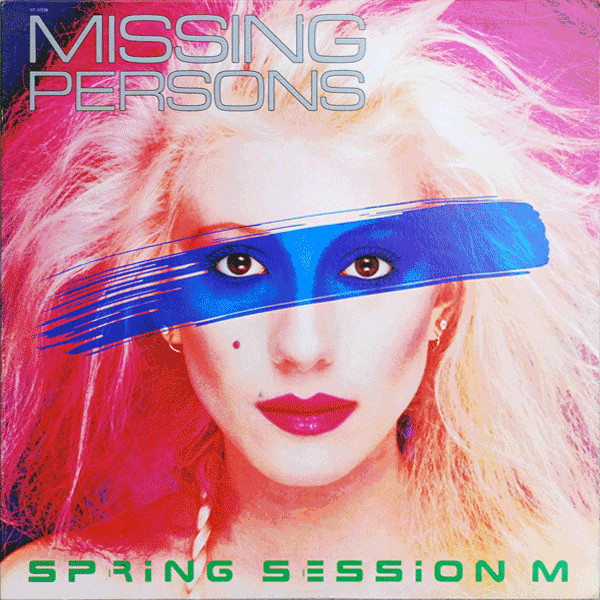

# Spring Session M

By Missing Persons

## Album Data

[Discogs URL](https://www.discogs.com/release/4907670-Missing-Persons-Spring-Session-M)

- Label: Capitol Records
- Formats: Vinyl, LP, Album
- Genres: Electronic, Rock, New Wave, Synth-pop
- Rating: 4.05
- Released: 1982
- Year: 1982
- Release ID: 4907670
- Media condition: 
- Sleeve condition: 
- Speed: 
- Weight: 
- Notes: 

## Album Tracks

| **Position** | **Title** | **Duration** |
|--------------|-----------|--------------|
| A1 | **Noticeable One** | 3:22 |
| A2 | **Windows** | 4:59 |
| A3 | **It Ain't None Of Your Business** | 2:55 |
| A4 | **Destination Unknown** | 3:34 |
| A5 | **Walking In L.A.** | 3:59 |
| A6 | **U.S. Drag** | 3:36 |
| B1 | **Tears** | 4:22 |
| B2 | **Here And Now** | 3:26 |
| B3 | **Words** | 4:25 |
| B4 | **Bad Streets** | 3:41 |
| B5 | **Rock And Roll Suspension** | 2:34 |
| B6 | **No Way Out** | 2:45 |

## Artist Roles

| **Name** | **Role** |
|----------|----------|
| **Dale Bozzio** | Arranged By, Vocals |
| **Terry Bozzio** | Arranged By, Vocals |
| **Warren Cuccurullo** | Arranged By, Vocals |
| **Kurt Triffet** | Artwork, Design |
| **Patrick O'Hearn** | Bass, Electric Bass, Synthesizer |
| **Steve Brooks** | Coordinator [Production Coordinator] |
| **Terry Bozzio** | Drums |
| **Brian Leshon** | Engineer [Assistant] |
| **Phil Jost** | Engineer [Assistant] |
| **Ralph Sutton** | Engineer [Assistant] |
| **Ken Scott** | Engineer, Producer, Management |
| **Elmi Graphics** | Graphics [Dye Transfer (Color Retouching)] |
| **Warren Cuccurullo** | Guitar |
| **Chuck Wild** | Keyboards |
| **Terry Bozzio** | Keyboards |
| **Bernie Grundman** | Mastered By |
| **Tracy Hill, Doug Powell, Cheri Gregg** | Other [Hair] |
| **Angelika Schubert** | Other [Make-up] |
| **Glen Wexler** | Photography By, Art Direction, Design |
| **Terry Bozzio** | Written-By |

