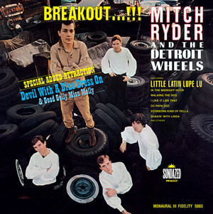

# Breakout...!!!

By Mitch Ryder & The Detroit Wheels

## Album Data

[Discogs URL](https://www.discogs.com/release/3110774-Mitch-Ryder-And-The-Detroit-Wheels-Breakout)

- Label: Sundazed Music
- Formats: Vinyl, LP, Album, Reissue, Mono
- Genres: Funk / Soul, Blues, Rhythm & Blues, Soul
- Rating: 4.21
- Released: 2002
- Year: 1966
- Release ID: 3110774
- Media condition: 
- Sleeve condition: 
- Speed: 
- Weight: 
- Notes: 

## Album Tracks

| **Position** | **Title** | **Duration** |
|--------------|-----------|--------------|
| A1 | **Walking The Dog** | 2:27 |
| A2 | **I Had It Made** | 2:40 |
| A3 | **In The Midnight Hour** | 2:31 |
| A4 | **Oo Papa Doo** | 2:46 |
| A5 | **I Like It Like That** | 2:45 |
| A6 | **Any Day Now** | 3:17 |
| A7 | **Little Latin Lupe Lu** | 3:07 |
| B1 | **Devil With A Blue Dress On / Good Golly Miss Molly** | 3:01 |
| B2 | **Shakin' With Linda** | 3:15 |
| B3 | **Stubborn Kind Of Fellow** | 3:09 |
| B4 | **You Get Your Kicks** | 3:09 |
| B5 | **I Need Help** | 2:26 |
| B6 | **Breakout** | 3:14 |

## Artist Roles

| **Name** | **Role** |
|----------|----------|
| **Bob Crewe** | Arranged By, Conductor, Producer |

