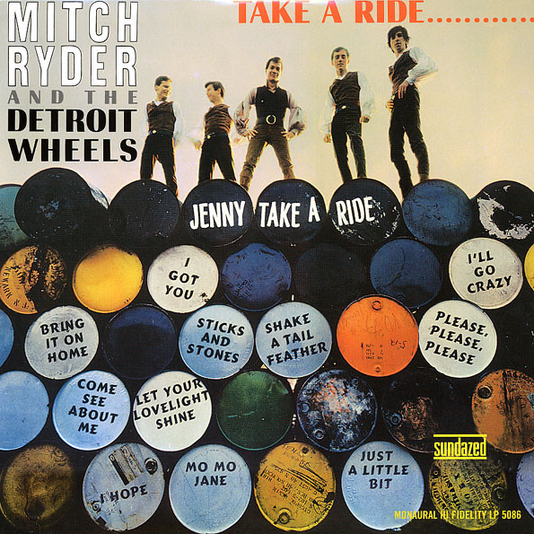

# Take A Ride...

By Mitch Ryder & The Detroit Wheels

## Album Data

[Discogs URL](https://www.discogs.com/release/4195557-Mitch-Ryder-The-Detroit-Wheels-Take-A-Ride)

- Label: Sundazed Music
- Formats: Vinyl, LP, Album, Mono, Reissue
- Genres: Rock, Funk / Soul, Blues, Rock & Roll, Garage Rock, Blues Rock, Soul, Electric Blues, Rhythm & Blues, Classic Rock
- Rating: 4.47
- Released: 2003
- Year: 1966
- Release ID: 4195557
- Media condition: 
- Sleeve condition: 
- Speed: 
- Weight: 
- Notes: 

## Album Tracks

| **Position** | **Title** | **Duration** |
|--------------|-----------|--------------|
| A1 | **Shake A Tail Feather** | 2:28 |
| A2 | **Come See About Me** | 3:00 |
| A3 | **Let Your Lovelight Shine** | 3:36 |
| A4 | **Just A Little Bit** | 2:40 |
| A5 | **I Hope** | 3:00 |
| A6 | **Jenny Take A Ride** | 3:25 |
| B1 | **Please, Please, Please** | 3:34 |
| B2 | **I'll Go Crazy** | 2:08 |
| B3 | **I Got You** | 2:33 |
| B4 | **Sticks And Stones** | 3:07 |
| B5 | **Bring It On Home To Me** | 3:33 |
| B6 | **Baby Jane (Mo-Mo Jane)** | 3:59 |

## Artist Roles

| **Name** | **Role** |
|----------|----------|
| **Bob Crewe** | Arranged By, Conductor, Producer |
| **Steven Craig Productions** | Design |
| **Gordon Clark** | Engineer |
| **Harry Yarmark** | Engineer |
| **George Ingram** | Lacquer Cut By |
| **Howard Cook (2)** | Liner Notes |
| **Ron Harris (8)** | Photography By [Cover] |

