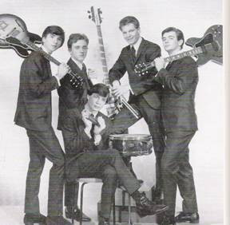

# Mitch Ryder & The Detroit Wheels

## Artist Profile

Rock and Soul band from Detroit, Michigan, USA, formed in 1964. They served as Mitch Ryder's backup band from 1964 to 1967, when Ryder was enticed away by Bob Crewe with offers of a solo career, after which The Detroit Wheels recorded a handful of singles, then quickly dissolved. Two of its former members, Jim McCarty (2) and Johnny Badanjek, later reunited to establish the nucleus of a new band called The Rockets (5), after McCarty found some fame with the hard rock outfit Cactus (3). In 1969 Ryder & Johnny Badanjek and some other musicians established a new band called The Band Detroit aka Detroit (2), which recorded an eponymous named album in 1971. Ryder's musical endeavors would see less success after the early 1970s. In 2005, Mitch Ryder & The Detroit Wheels were inducted into the Michigan Rock and Roll Legends Hall of Fame, and in 2009, Mitch Ryder was inducted as a solo artist.

## Artist Links

- [https://en.wikipedia.org/wiki/The_Detroit_Wheels#Mitch_Ryder_.26_The_Detroit_Wheels](https://en.wikipedia.org/wiki/The_Detroit_Wheels#Mitch_Ryder_.26_The_Detroit_Wheels)
- [http://mitchryder.net/](http://mitchryder.net/)

## See also

- [Breakout...!!!](Breakout!!!.md)
- [Take A Ride...](Take_A_Ride.md)
