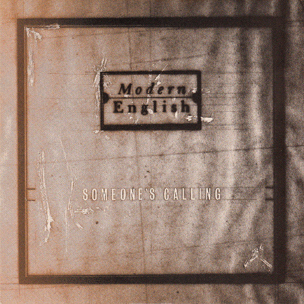

# Someone's Calling

By Modern English

## Album Data

[Discogs URL](https://www.discogs.com/release/6145401-Modern-English-Someones-Calling)

- Label: Sire
- Formats: Vinyl, 7", 45 RPM
- Genres: Electronic, Synth-pop, Experimental
- Rating: 5
- Released: 1983
- Year: 1983
- Release ID: 6145401
- Media condition: 
- Sleeve condition: 
- Speed: 
- Weight: 
- Notes: 

## Album Tracks

| **Position** | **Title** | **Duration** |
|--------------|-----------|--------------|
| A | **Someone's Calling** | 3:53 |
| B | **Carry Me Down** | 3:56 |

