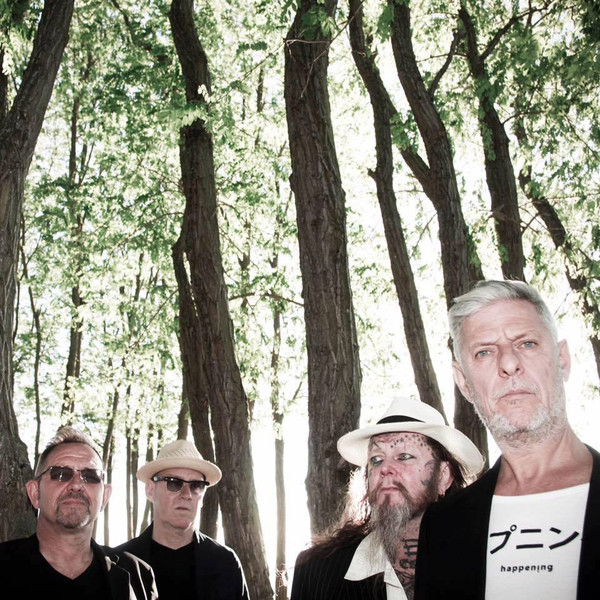

# Modern English

## Artist Profile

Modern English were formed in Colchester, Essex, England, in 1977 by Robbie Grey (Vocals), Gary McDowell (Guitar) and Michael Conroy (Bass). Originally known as the Lepers, the band made their name in the burgeoning punk scene where they would get together exclusively to play at parties, until they were picked up by 4AD. Richard Brown (Drums) and Stephen Walker (Keyboards) were subsequently added to the line-up of the band. A debut single, "Drowning Man" was released in 1980 on the Limp Records label. The band's debut full-length; "Mesh & Lace", released by 4AD a year later, it drew heavily on the gloomy post-punk sound already patented by bands such as Joy Division. The follow-up "After The Snow" showed a huge progression, as they introduced warmth and strong guitar harmonies (most notably on the minor classic "I Melt With You"), rejecting the tinny bleakness of the debut. It was especially well received in the USA, and the band relocated to New York to consolidate a popularity encouraged by college radio. 1984's "Richochet Days" had a crisper production but less creative experimentation. By the time of "Stop Start" (1986), the band had left 4AD and Walker and Brown had quit the band and Aaron Davidson (Keyboards, Guitar) had joined. Grey initially returned to England to form a new outfit, but reconvened Modern English in 1990 with Davidson and Conroy and released "Pillow Lips" on the TVT label in 1990. Robbie Grey with new band members Ted Mason (guitars) and Matthew Shipley (keyboards) co wrote and produced a second release for TVT though it received very little enthusiasm from the label. In 1995, the new Modern English line up recorded and released "Everything's Mad" on the Imago label. In 1998 the line up changed again, keeping Matthew Shipley and adding Steven Walker (guitars), Ian Robbins (bass) and Jon Solomon (drums). In 1999 Ian was replaced by Nik Williams (bass). In 2001 they recorded a new album 'Soundtrack' with producer Hugh Jones but due to the collapse of the record company it was shelved. Finally in 2010 this album was released by Darla. In 2009 the original band line up, minus Richard Brown, reformed and tour mainly in the US but also did shows in the UK, Europe and Asia. They wrote, recorded and self released a new album with Martyn Young (Colourbox) in 2017 called ‘Take Me To The Trees’. The band continue to tour and are currently working on their next album.

## Artist Links

- [http://www.modernenglish.me](http://www.modernenglish.me)
- [http://forum.modernenglish.me](http://forum.modernenglish.me)
- [http://en.wikipedia.org/wiki/Modern_English_%28band%29](http://en.wikipedia.org/wiki/Modern_English_%28band%29)

## See also

- [Someone's Calling](Someones_Calling.md)
