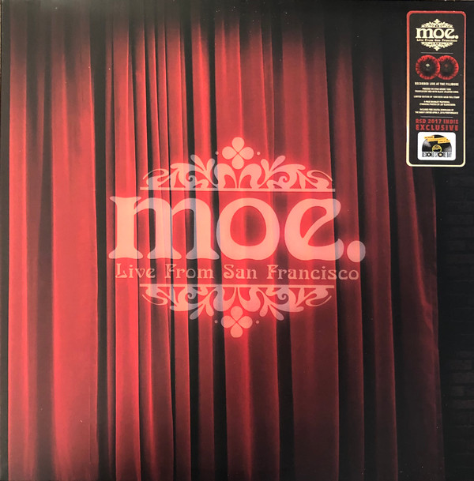

# Live From San Francisco

By Moe.

## Album Data

[Discogs URL](https://www.discogs.com/release/10175991-Moe-Live-From-San-Francisco)

- Label: Brookvale Records
- Formats: Vinyl, LP, Limited Edition, Numbered
- Genres: Rock, Psychedelic Rock
- Rating: 4.76
- Released: 2017-04-22
- Year: 2017
- Release ID: 10175991
- Media condition: 
- Sleeve condition: 
- Speed: 
- Weight: 
- Notes: 

## Album Tracks

| **Position** | **Title** | **Duration** |
|--------------|-----------|--------------|
| A1 | **Annihilation Blues** | 4:41 |
| A2 | **Opium** | 13:32 |
| B1 | **Brittle End** | 6:27 |
| B2 | **Downward Facing Dog** | 11:01 |
| C1 | **Queen Of Everything** | 7:19 |
| C2 | **Puebla** | 11:34 |
| D1 | **Silver Sun** | 15:01 |

## Artist Roles

| **Name** | **Role** |
|----------|----------|
| **Rob Derhak** | Bass Guitar, Vocals |
| **Philip McGonigle** | Creative Director |
| **Vinnie Amico** | Drums |
| **Casey Latter** | Engineer, Mixed By |
| **Chuck Garvey** | Guitar, Vocals |
| **Al Schnier** | Guitar, Vocals, Keyboards, Mandolin |
| **Alex Abrash** | Mastered By |
| **Jim Loughlin** | Percussion |
| **Jay Blakesberg** | Photography By |
| **Steve Young (12)** | Recorded By |

