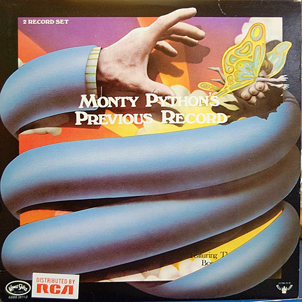

# Another Monty Python Record

By Monty Python

## Album Data

[Discogs URL](https://www.discogs.com/release/1568281-Monty-Pythons-Flying-Circus-Another-Monty-Python-Record)

- Label: Buddah Records
Charisma
- Formats: Vinyl, LP
- Genres: Non-Music, Dialogue, Comedy
- Rating: 3.62
- Released: 1972
- Year: 1971
- Release ID: 1568281
- Media condition: 
- Sleeve condition: 
- Speed: 
- Weight: 
- Notes: 

## Album Tracks

| **Position** | **Title** | **Duration** |
|--------------|-----------|--------------|
| A | **Another Monty Python Record** |  |
| B | **Another Monty Python Record** |  |

## Artist Roles

| **Name** | **Role** |
|----------|----------|
| **The Fred Tomlinson Singers** | Chorus |
| **Tony Taverner** | Engineer |
| **Will Roper** | Engineer |
| **Fred Tomlinson** | Music By |
| **Carol Cleveland** | Performer |
| **Terry Gilliam** | Performer |
| **Eric Idle** | Performer, Written-By |
| **Graham Chapman** | Performer, Written-By |
| **John Cleese** | Performer, Written-By |
| **Michael Palin** | Performer, Written-By |
| **Michael Palin** | Producer |
| **Terry Jones** | Producer |
| **Colin Caldwell** | Recorded By |

