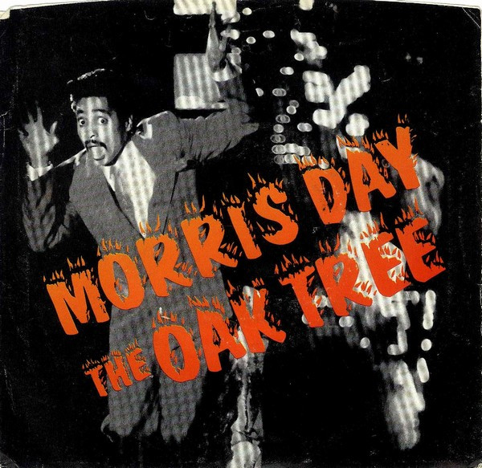

# The Oak Tree

By Morris Day

## Album Data

[Discogs URL](https://www.discogs.com/release/1171356-Morris-Day-The-Oak-Tree)

- Label: Warner Bros. Records
Warner Bros. Records
- Formats: Vinyl, 7", 45 RPM
- Genres: Electronic, Funk / Soul, Downtempo, Funk
- Rating: 3.89
- Released: 1985
- Year: 1985
- Release ID: 1171356
- Media condition: 
- Sleeve condition: 
- Speed: 
- Weight: 
- Notes: 

## Album Tracks

| **Position** | **Title** | **Duration** |
|--------------|-----------|--------------|
| A | **The Oak Tree** | 4:32 |
| B | **The Oak Tree (Dance Instrumental)** | 3:45 |

## Artist Roles

| **Name** | **Role** |
|----------|----------|
| **Morris Day** | Producer, Written-By, Arranged By |

