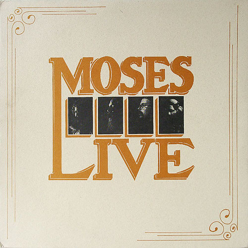

# Moses Live

By Moses

## Album Data

[Discogs URL](https://www.discogs.com/release/5589433-Moses-Moses-Live)

- Label: Red Dirt Records
- Formats: Vinyl, LP, Album, Stereo
- Genres: Rock, Country Rock, Rock & Roll, Blues Rock
- Rating: 4.67
- Released: 1974
- Year: 1974
- Release ID: 5589433
- Media condition: 
- Sleeve condition: 
- Speed: 
- Weight: 
- Notes: 

## Album Tracks

| **Position** | **Title** | **Duration** |
|--------------|-----------|--------------|
| A1 | **Workin'** |  |
| A2 | **Oklahoma Blues** |  |
| A3 | **Shake A Tailfeather** |  |
| A4 | **Morning Sun ** |  |
| A5 | **Hand Jive** |  |
| A6 | **Shake, Rattle & Roll** |  |
| B1 | **Playing In The Band** |  |
| B2 | **Wear My Ring** |  |
| B3 | **When I'm 64** |  |
| B4 | **Okie From Muskogee** |  |
| B5 | **Saturday Night's Alright For Fighting** |  |

## Artist Roles

| **Name** | **Role** |
|----------|----------|
| **Carl Brune** | Artwork By [Label] |
| **Robert Hatfield** | Bass |
| **Pat Morabito** | Design, Layout |
| **Bruce Hueston** | Drums |
| **Gordon Shryock** | Engineer |
| **Suzanne Lane** | Engineer |
| **Steve Ripley** | Guitar |
| **Steve Irby (2)** | Keyboards |
| **Moses (10)** | Mixed By |
| **Steve Ripley** | Mixed By |
| **James Nay** | Photography |
| **Paul Zarkovich** | Photography |
| **Wes Gray** | Photography |
| **Cris A. Burns** | Photography By |
| **Moses (10)** | Producer |
| **Bruce Hueston** | Vocals |
| **Robert Hatfield** | Vocals |
| **Steve Irby (2)** | Vocals |
| **Steve Ripley** | Vocals |

