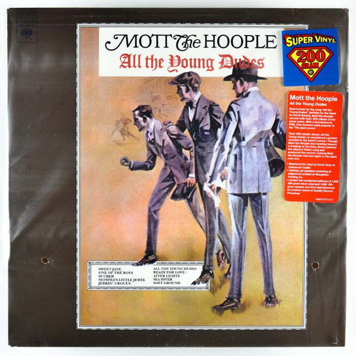

# All The Young Dudes

By Mott The Hoople

## Album Data

[Discogs URL](https://www.discogs.com/release/6288883-Mott-The-Hoople-All-The-Young-Dudes)

- Label: Drastic Plastic Records
Sony Music Commercial Music Group
Columbia
- Formats: Vinyl, LP, Album, Limited Edition, Numbered, Reissue, Remastered
- Genres: Rock, Glam, Classic Rock
- Rating: 4.45
- Released: 2014
- Year: 1972
- Release ID: 6288883
- Media condition: 
- Sleeve condition: 
- Speed: 
- Weight: 
- Notes: 

## Album Tracks

| **Position** | **Title** | **Duration** |
|--------------|-----------|--------------|
| A1 | **Sweet Jane** |  |
| A2 | **Momma's Little Jewel** |  |
| A3 | **All The Young Dudes** |  |
| A4 | **Sucker** |  |
| A5 | **Jerkin' Crocus** |  |
| B1 | **One Of The Boys** |  |
| B2 | **Soft Ground** |  |
| B3 | **Ready For Love/After Lights** |  |
| B4 | **Sea Diver** |  |

## Artist Roles

| **Name** | **Role** |
|----------|----------|
| **Overend Watts** | Bass |
| **Dale Griffin** | Drums |
| **David Hentschel** | Engineer |
| **Keith Harwood** | Engineer |
| **Ted Sharp** | Engineer |
| **David Bowie** | Producer, Saxophone |
| **Kevin Gray** | Remastered By |
| **Mick Ralphs** | Vocals, Guitar |
| **Verden Allen** | Vocals, Organ |
| **Ian Hunter** | Vocals, Piano |

