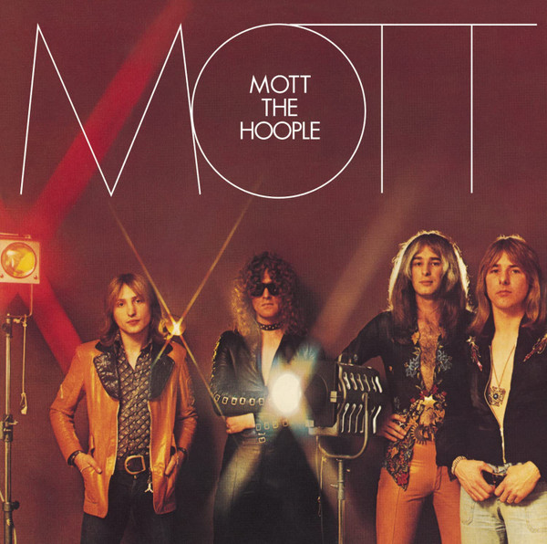

# Mott The Hoople

## Artist Profile

British rock band, active from 1969 until 1974, with occasional reunions from 2009 onwards.

Classic Era Members:
Ian Hunter - Vocals And Guitar 
Mick Ralphs - Guitar 
Verden Allen - Keyboards 
Peter "Overend" Watts - Bass 
Dale "Buffin" Griffin - Drums 

Two follow-on bands after Ian Hunter left in 1974:
1974–1976 (Mott (3)) 
1977–1980 (British Lions) 

Use Mott (3) only for releases without Hunter, dating from the 1974-76 period.

An unofficial or "fake" band also (re-)recorded MTH tracks around 1996/7. For these releases, please use Mott The Hoople (2).

## Artist Links

- [https://www.mottthehoople-74.com/](https://www.mottthehoople-74.com/)
- [https://www.facebook.com/MottTheHoople74](https://www.facebook.com/MottTheHoople74)
- [https://www.instagram.com/mottthehoople74/](https://www.instagram.com/mottthehoople74/)
- [https://twitter.com/mottthehoople](https://twitter.com/mottthehoople)
- [https://en.wikipedia.org/wiki/Mott_the_Hoople](https://en.wikipedia.org/wiki/Mott_the_Hoople)
- [https://www.imdb.com/name/nm3082537/](https://www.imdb.com/name/nm3082537/)

## See also

- [All The Young Dudes](All_The_Young_Dudes.md)
- [Mott](Mott.md)
