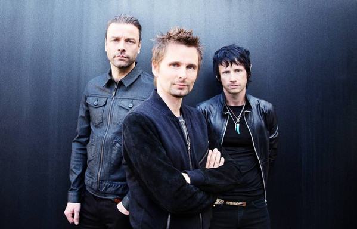

# Muse

## Artist Profile

Muse are an English rock band from Teignmouth, Devon, formed in 1994. The band consists of Matthew Bellamy (lead vocals, guitar, keyboards, piano), Christopher Wolstenholme (bass guitar, backing vocals) and Dominic Howard (drums, backing vocals). Dan Lancaster joins Muse on live stage since 2022 (previously Morgan Nicholls) for additional instruments and vocals.

Muse signed to Maverick Records and released their debut album, Showbiz, in 1999, showcasing Bellamy's falsetto and a melancholic alternative rock style. Their second album, Origin of Symmetry (2001), incorporated wider instrumentation and romantic classical influences, and earned them a reputation for energetic live performances. Absolution (2003) saw further classical influence, with orchestra on tracks such as "Butterflies & Hurricanes", and became the first of five consecutive UK number-one albums.

Black Holes & Revelations (2006) incorporated electronic and pop elements, displayed in singles such as "Supermassive Black Hole". The album brought Muse wider international success. The Resistance (2009), loosely based on the novel 1984, and The 2nd Law (2012) explored themes of government oppression and civil uprising and cemented Muse as one of the world's major stadium acts. Their seventh album, Drones (2015), was a concept album about drone warfare and returned to a harder rock sound. Their eighth album, Simulation Theory, featuring a retro 1980s style, was released on November 9th, 2018. Will of the People, their latest to date album, was released on August 26th, 2022 and is inspired by the current years events, such as the Covid-19 pandemic, riots, Black Lives Matter movement, and so on.

Muse have won numerous awards, including two Grammy Awards, two Brit Awards, five MTV Europe Music Awards and eight NME Awards. In 2012 they received the Ivor Novello Award for International Achievement from the British Academy of Songwriters, Composers and Authors. They have sold over 20 million albums worldwide.

When marked as a copyright holder, use Muse (4).

## Artist Links

- [https://www.muse.mu/](https://www.muse.mu/)
- [https://www.facebook.com/muse](https://www.facebook.com/muse)
- [https://www.instagram.com/muse/](https://www.instagram.com/muse/)
- [https://twitter.com/muse](https://twitter.com/muse)
- [https://myspace.com/muse](https://myspace.com/muse)
- [https://www.youtube.com/muse](https://www.youtube.com/muse)
- [https://www.musewiki.org/](https://www.musewiki.org/)
- [https://en.wikipedia.org/wiki/Muse_(band)](https://en.wikipedia.org/wiki/Muse_(band))

## See also

- [Absolution](Absolution.md)
- [Black Holes And Revelations](Black_Holes_And_Revelations.md)
- [The 2nd Law](The_2nd_Law.md)
- [The Resistance](The_Resistance.md)
