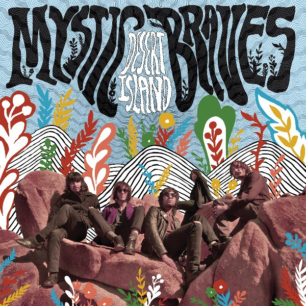

# Desert Island

By Mystic Braves

## Album Data

[Discogs URL](https://www.discogs.com/release/5831165-Mystic-Braves-Desert-Island)

- Label: Lolipop Records
- Formats: Vinyl, LP, Album, Limited Edition
- Genres: Rock, Psychedelic Rock, Garage Rock, Folk Rock
- Rating: 4.63
- Released: 2014-04-29
- Year: 2014
- Release ID: 5831165
- Media condition: 
- Sleeve condition: 
- Speed: 
- Weight: 
- Notes: 

## Album Tracks

| **Position** | **Title** | **Duration** |
|--------------|-----------|--------------|
| A1 | **Bright Blue Day Haze** | 4:12 |
| A2 | **There's A Pain** | 2:43 |
| A3 | **Coyote Blood** | 2:53 |
| A4 | **Desert Island** | 2:49 |
| A5 | **Valley Rat** | 4:22 |
| B1 | **You Take The Dark Out Of Me** | 3:51 |
| B2 | **I Want You Back** | 2:46 |
| B3 | **Born Without A Heart** | 3:35 |
| B4 | **In The Past** | 2:32 |
| B5 | **Earthshake** | 4:22 |

## Artist Roles

| **Name** | **Role** |
|----------|----------|
| **Harrison Roberts** | Artwork |
| **Tony Malacara** | Bass, Vocals |
| **Cameron Gartung** | Drums |
| **Henry Stotsenberg** | Executive-Producer |
| **Julian Ducatenzeiler** | Guitar, Vocals |
| **Shane Stotsenberg** | Guitar, Vocals |
| **Chris Bellman** | Mastered By |
| **Ignacio Gonzalez** | Organ, Percussion |
| **Victor Ducatenzeiler** | Trumpet |

