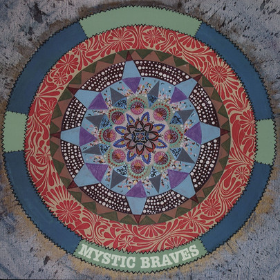

# Mystic Braves

By Mystic Braves

## Album Data

[Discogs URL](https://www.discogs.com/release/5653506-Mystic-Braves-Mystic-Braves)

- Label: Not On Label
- Formats: Vinyl, LP, Album, Reissue
- Genres: Rock, Psychedelic Rock, Garage Rock, Folk Rock, Country Rock
- Rating: 4.39
- Released: 2013
- Year: 2013
- Release ID: 5653506
- Media condition: 
- Sleeve condition: 
- Speed: 
- Weight: 
- Notes: 

## Album Tracks

| **Position** | **Title** | **Duration** |
|--------------|-----------|--------------|
| A1 | **Mystic Rabbit** |  |
| A2 | **Trippin' Like I Do** |  |
| A3 | **Open Up Your Heart** |  |
| A4 | **Misery Loves Company** |  |
| A5 | **Oh So Fine** |  |
| B1 | **Cloud 9** |  |
| B2 | **Strange Lovers** |  |
| B3 | **Vicious Cycle** |  |
| B4 | **High N'Dry ** |  |

## Artist Roles

| **Name** | **Role** |
|----------|----------|
| **Tony Malacara** | Bass, Vocals |
| **Cameron Gartung** | Drums, Percussion |
| **Julian Ducatenzeiler** | Guitar, Vocals |
| **Shane Stotsenberg** | Guitar, Vocals |
| **Julian Ducatenzeiler** | Songwriter |
| **Tony Malacara** | Songwriter |

