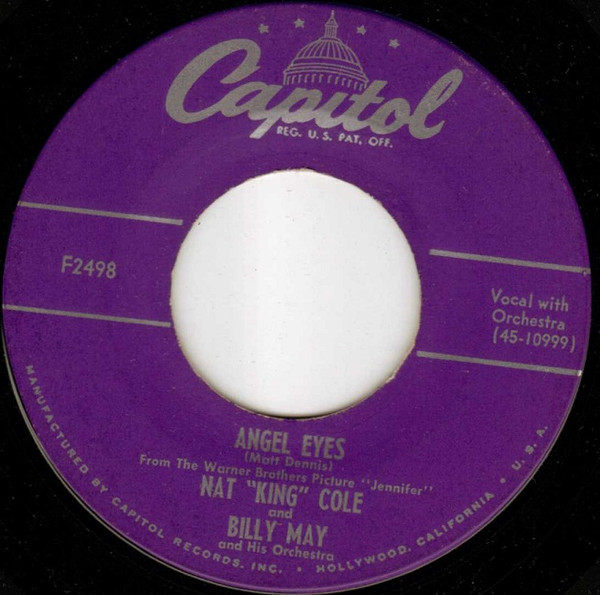

# Angel Eyes

By Nat King Cole

## Album Data

[Discogs URL](https://www.discogs.com/release/8641559-Nat-King-Cole-and-Billy-May-And-His-Orchestra-Angel-Eyes)

- Label: Capitol Records
- Formats: Vinyl, 7", 45 RPM
- Genres: Pop, Stage & Screen
- Rating: 0
- Released: null
- Year: 1953
- Release ID: 8641559
- Media condition: 
- Sleeve condition: 
- Speed: 
- Weight: 
- Notes: 

## Album Tracks

| **Position** | **Title** | **Duration** |
|--------------|-----------|--------------|
| A | **Angel Eyes** |  |
| B | **Return To Paradise** |  |

