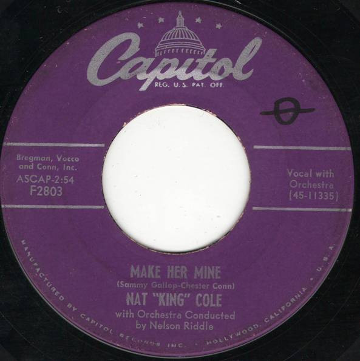

# Make Her Mine

By Nat King Cole

## Album Data

[Discogs URL](https://www.discogs.com/release/4123211-Nat-King-Cole-Make-Her-Mine)

- Label: Capitol Records
- Formats: Vinyl, 7", 45 RPM, Single
- Genres: Jazz
- Rating: 4
- Released: 1954
- Year: 1954
- Release ID: 4123211
- Media condition: 
- Sleeve condition: 
- Speed: 
- Weight: 
- Notes: 

## Album Tracks

| **Position** | **Title** | **Duration** |
|--------------|-----------|--------------|
| A | **Make Her Mine** | 2:54 |
| B | **I Envy** | 2:39 |

