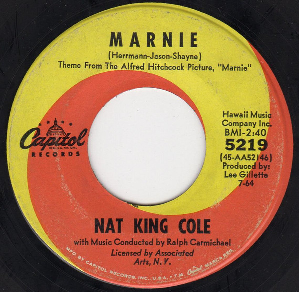

# Marnie / More And More Of Your Amor

By Nat King Cole

## Album Data

[Discogs URL](https://www.discogs.com/release/8670010-Nat-King-Cole-Marnie-More-And-More-Of-Your-Amor)

- Label: Capitol Records
- Formats: Vinyl, 7", Single
- Genres: Jazz, Easy Listening
- Rating: 0
- Released: 1964
- Year: 1964
- Release ID: 8670010
- Media condition: 
- Sleeve condition: 
- Speed: 
- Weight: 
- Notes: 

## Album Tracks

| **Position** | **Title** | **Duration** |
|--------------|-----------|--------------|
| A | **Marnie** | 2:40 |
| B | **More And More Of Your Amor** | 2:27 |

## Artist Roles

| **Name** | **Role** |
|----------|----------|
| **Ralph Carmichael** | Conductor |
| **Lee Gillette** | Producer |

