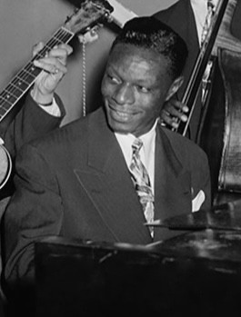

# Nat King Cole

## Artist Profile

Nat King Cole came to attention as a leading jazz pianist in the late 1930's. His trio of piano, guitar, & bass was emulated by many.
Born: March 17, 1919 in Montgomery, Alabama, U.S.A.
Deceased: February 15, 1965 in Santa Monica, California, U.S.A.
Husband of Maria Cole.
Father of Natalie Cole and Carole Cole.
Brother of Eddie Cole (3), Ike Cole, and Freddy Cole.
Uncle of Lionel Cole.
In 1943, with his composition "Straighten Up and Fly Right", he had his first vocal hit. With his soft, baritone voice, Cole became an icon recording much mainstream, pop orientated material. Cole was one of the first African Americans to host a television variety show, with "The Nat King Cole Show" premiering on November 5, 1956, on NBC.
 His numerous awards include the Grammy Lifetime Achievement Award in 1990, and being inducted into the Down Beat Jazz Hall of Fame in 1997 and into the Rock And Roll Hall of Fame in 2000 as a major influence on early rock & roll.

## Artist Links

- [https://www.natkingcole.com/](https://www.natkingcole.com/)
- [http://natkingcole.50webs.com/](http://natkingcole.50webs.com/)
- [https://spriee.com/people/nat-king-cole/](https://spriee.com/people/nat-king-cole/)
- [https://en.wikipedia.org/wiki/Nat_King_Cole](https://en.wikipedia.org/wiki/Nat_King_Cole)
- [https://www.britannica.com/biography/Nat-King-Cole](https://www.britannica.com/biography/Nat-King-Cole)
- [https://www.imdb.com/name/nm0170713/](https://www.imdb.com/name/nm0170713/)
- [https://adp.library.ucsb.edu/index.php/mastertalent/detail/104560/Cole_Nat_King](https://adp.library.ucsb.edu/index.php/mastertalent/detail/104560/Cole_Nat_King)

## See also

- [Angel Eyes](Angel_Eyes.md)
- [Make Her Mine](Make_Her_Mine.md)
- [Marnie / More And More Of Your Amor](Marnie_-_More_And_More_Of_Your_Amor.md)
- [The Best Of Nat King Cole](The_Best_Of_Nat_King_Cole.md)
- [The Christmas Song (Merry Christmas To You) / The Little Boy That Santa Claus Forgot](The_Christmas_Song_Merry_Christmas_To_You_-_The_Little_Boy_That_Santa_Claus_Forgot.md)
