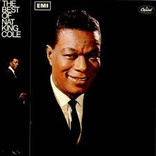

# The Best Of Nat King Cole

By Nat King Cole

## Album Data

[Discogs URL](https://www.discogs.com/release/5540861-Nat-King-Cole-The-Best-Of-Nat-King-Cole)

- Label: Capitol Records
- Formats: Vinyl, LP, Compilation, Reissue
- Genres: Jazz, Swing
- Rating: 4.5
- Released: 1980
- Year: 1968
- Release ID: 5540861
- Media condition: 
- Sleeve condition: 
- Speed: 
- Weight: 
- Notes: 

## Album Tracks

| **Position** | **Title** | **Duration** |
|--------------|-----------|--------------|
| A1 | **Mona Lisa** | 3:26 |
| A2 | **L-O-V-E** | 2:32 |
| A3 | **Answer Me, My Love** | 2:52 |
| A4 | **Sweet Lorraine** | 3:20 |
| A5 | **Too Young** | 3:22 |
| B1 | **Those Lazy-Hazy-Crazy Days Of Summer** | 1:21 |
| B2 | **I Don't Want To Be Hurt Anymore** | 2:26 |
| B3 | **Route 66** | 2:55 |
| B4 | **Dear Lonely Hearts** | 3:06 |
| B5 | **Ramblin' Rose** | 2:45 |

## Artist Roles

| **Name** | **Role** |
|----------|----------|
| **Dave Dexter, Jr.** | Producer |
| **Lee Gillette** | Producer |

