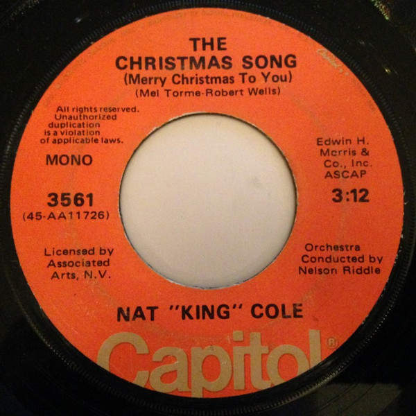

# The Christmas Song (Merry Christmas To You) / The Little Boy That Santa Claus Forgot

By Nat King Cole

## Album Data

[Discogs URL](https://www.discogs.com/release/6634627-Nat-King-Cole-The-Christmas-Song-Merry-Christmas-To-You-The-Little-Boy-That-Santa-Claus-Forgot)

- Label: Capitol Records
- Formats: Vinyl, 7", 45 RPM, Single, Reissue, Mono
- Genres: Pop, Vocal
- Rating: 5
- Released: 1973
- Year: 1956
- Release ID: 6634627
- Media condition: 
- Sleeve condition: 
- Speed: 
- Weight: 
- Notes: 

## Album Tracks

| **Position** | **Title** | **Duration** |
|--------------|-----------|--------------|
| A | **The Christmas Song (Merry Christmas To You)** | 3:12 |
| B | **The Little Boy That Santa Claus Forgot** | 2:31 |

## Artist Roles

| **Name** | **Role** |
|----------|----------|
| **Nelson Riddle** | Conductor [Orchestra] |

