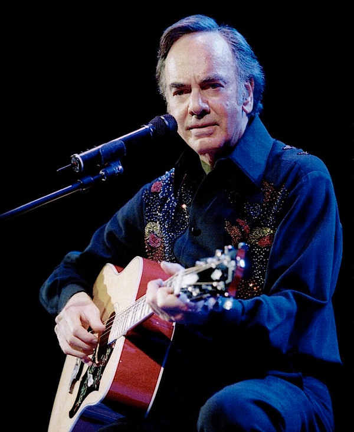

# Neil Diamond

## Artist Profile

American singer-songwriter and occasional actor, born January 24, 1941 in Brooklyn, New York, USA. Father of Jesse Diamond. Inducted into the Songwriters Hall of Fame in 1984.

## Artist Links

- [https://www.neildiamond.com/](https://www.neildiamond.com/)
- [https://en.wikipedia.org/wiki/Neil_Diamond](https://en.wikipedia.org/wiki/Neil_Diamond)
- [https://www.songhall.org/profile/Neil_Diamond](https://www.songhall.org/profile/Neil_Diamond)
- [https://www.imdb.com/name/nm0004871/](https://www.imdb.com/name/nm0004871/)

## See also

- [September Morn / I'm A Believer](September_Morn_-_Im_A_Believer.md)
