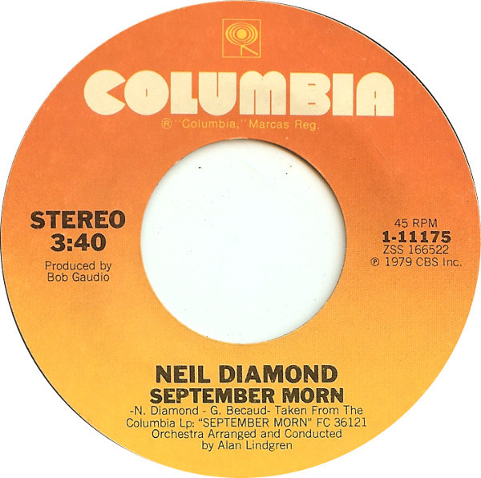

# September Morn / I'm A Believer

By Neil Diamond

## Album Data

[Discogs URL](https://www.discogs.com/release/1325133-Neil-Diamond-September-Morn-Im-A-Believer)

- Label: Columbia
- Formats: Vinyl, 7", Single, Styrene
- Genres: Pop, Vocal
- Rating: 3.67
- Released: 1979
- Year: 1980
- Release ID: 1325133
- Media condition: 
- Sleeve condition: 
- Speed: 
- Weight: 
- Notes: 

## Album Tracks

| **Position** | **Title** | **Duration** |
|--------------|-----------|--------------|
| A | **September Morn** | 3:40 |
| B | **I'm A Believer** | 2:21 |

## Artist Roles

| **Name** | **Role** |
|----------|----------|
| **Alan Lindgren** | Arranged By, Conductor [Orchestra] |
| **Bob Gaudio** | Producer |
| **Neil Diamond** | Written-By |

